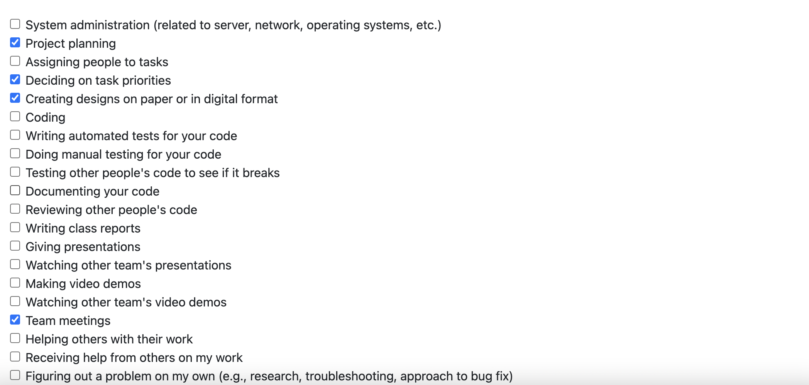
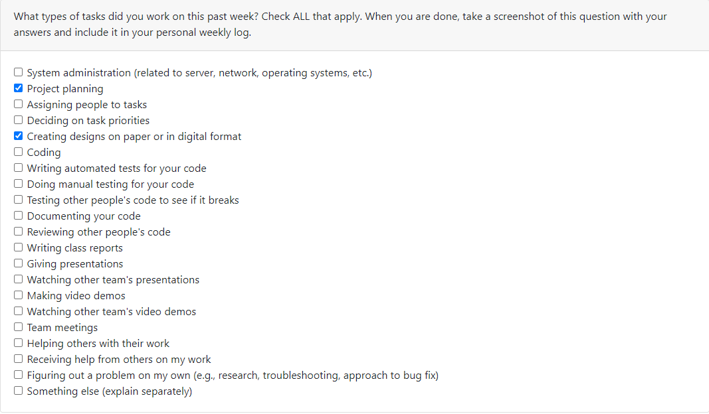
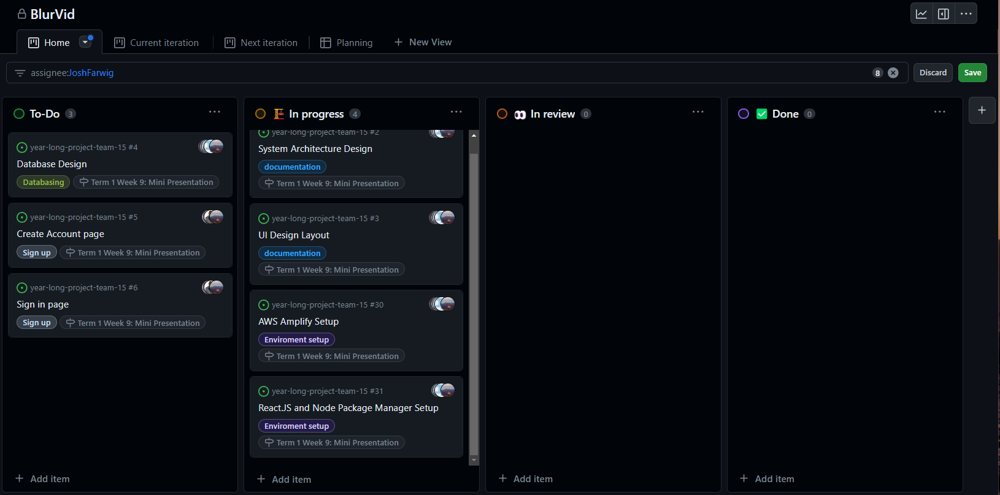
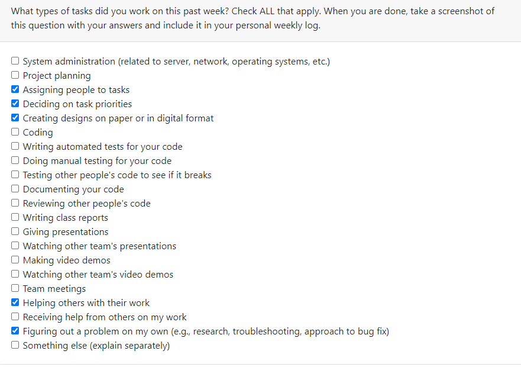
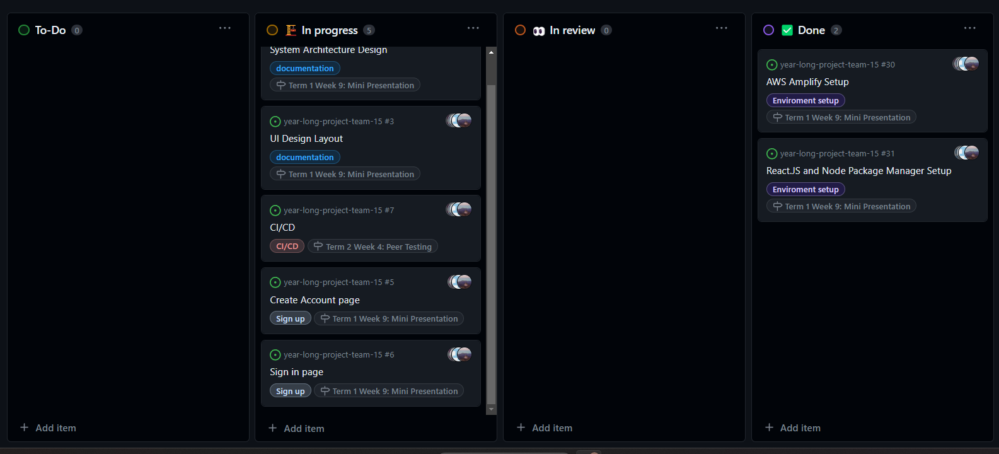
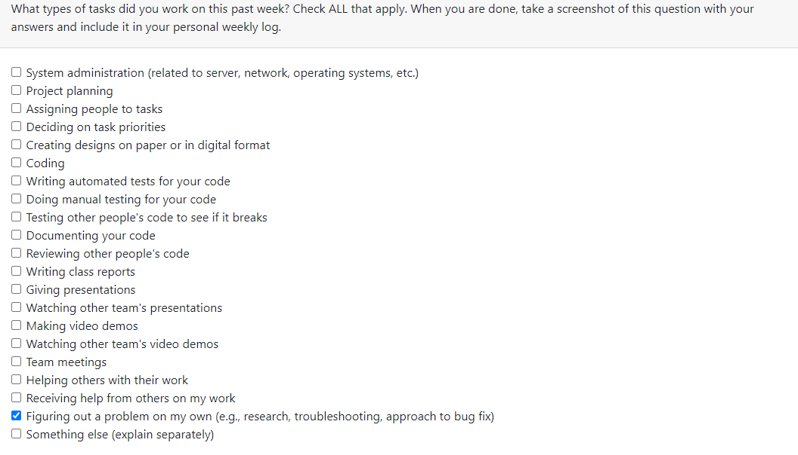
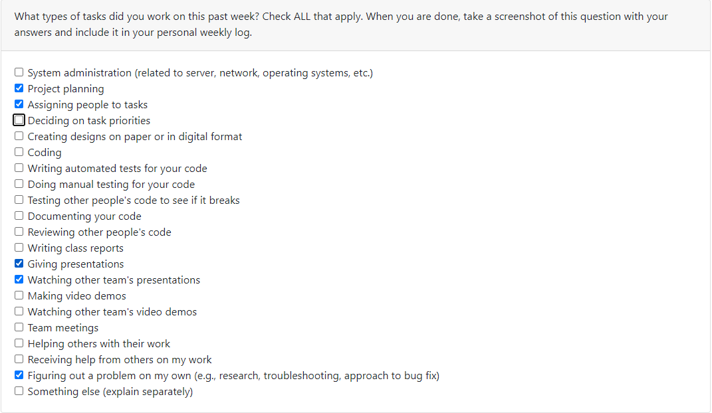
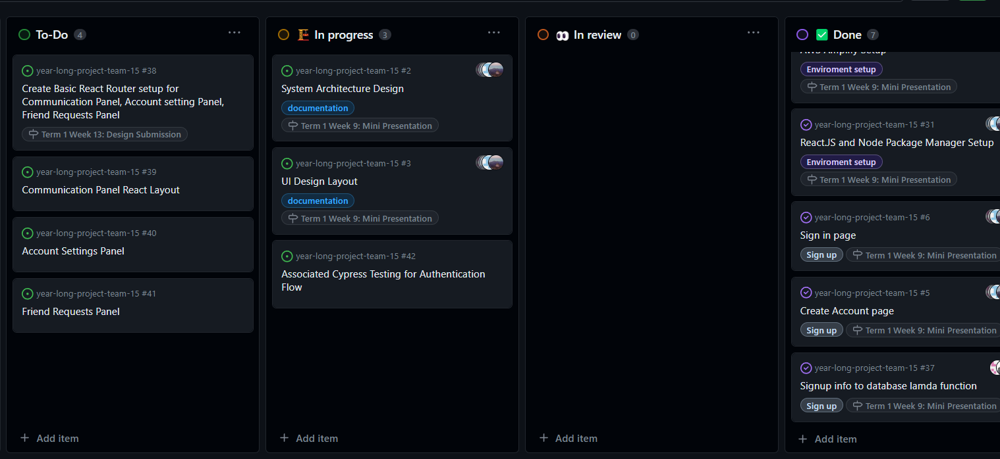
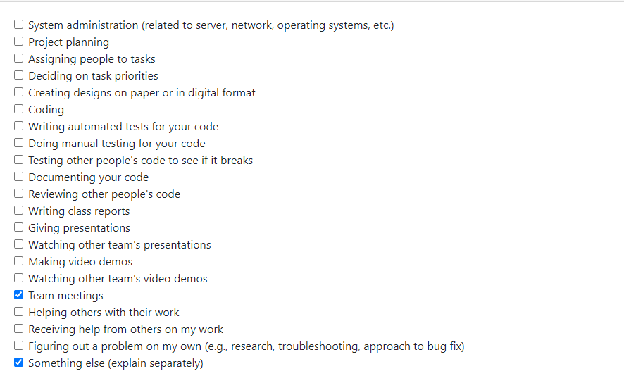

# Individual Log: Joshua Farwig (JoshFarwig) 
## Sept 24th - Oct 1st 2023 / Week 4 

Due to the nature of this week, not putting picture of task board since we didn't have any besides work on the project proposal

## Tasks Completed this week  
* Wrote MVP, User Scenarios, and Projected Tech Stack on the Project Proposal
* Discussed layout of UI with group to better understand what features we want to implement
* Discussed and refactored Tech Stack, still included somethings we weren't super sure on. 

## Tasks to Be Completed next week 
* Set up project repo
* Begin react.js / AWS Ampifily research 

# Individual Log: Joshua Farwig (JoshFarwig) 
## Oct 1st - Oct 8th 2023 / Week 5 

## Goals this week
* Set up project repo
* Begin react.js / AWS Ampifily research 

## Tasks In-Progress 
* Microservices System Architecture Design: Figma
* Complete UI Design Layout: Figma
* Setup AWS Ampifily
* install NPM for create-react-app and other dependencies

*filtered project board to show assigned tasks in the in-progess card*

## Tasks Completed 
* Set up project board: converted milestones and features to issues
* Set up branches for project organization 
* Create AWS accounts

*Tasks completed were not added as a screenshot since the tasks donw were setting up repo / project board for this week*

## Goals for next week
* Finish UI Design Layout
* Setup AWS Ampifily / integrate into GitHub
* Start coding a React.JS interface for Signin / Login page 

# Individual Log: Joshua Farwig (JoshFarwig) 
## Oct 8st - Oct 15th 2023 Week 6

### Week 6 Tasks

## Goals from the last two weeks
* Finish UI Design Layout
* Setup AWS Ampifilty / integrate into GitHub
* Learn React.JS Basics
* Start coding a React.JS interface for Signin / Login page

## Tasks In-Progress 
* Complete UI Design Layout, With Amplify UI KIT This time: Figma 
* Start coding a React.JS interface for Signin / Login page

*filtered project board to show assigned tasks in the in-progess card*

## Tasks Completed 
* Setup AWS Ampifily 
* Learn React.JS Basics (For the most part, need to look a bit more into routing / escape hatches / useContext hook)
* install NPM for create-react-app and other dependencies  

For AWS amplifly there was a few issues when setting up with our repo and with certian permissions. We were able to get it set up and however we were having issues setting up AWS amplifly CLI. reverted to studio, then was able to do CLI init commands for amplify. Messed around with the interface, got a littler more familar with it on Saturday with Will and Mac.

Learned basic React.JS concepts, however need to go more into state-management (Ways to pass props besides prop-drilling, useContext, useReference, etc.)

For The UI, I created a few basic Frames, I.E Hero page, login/signup, 
communication dashboard. However, Amplify has a pre-built figma-to-react SYNC as long as you use their figma UI Kit. So im re-doing the UI in this KIT instead so we can auto-generate components react components, then code the state management / buisness logic. 

## Goals for next week
* Finish Amplifiy UI KIT Design Layout 
* Sync Figma to React Components, start working with generated components
* Integrate pre-made auth components for a basic login / sign up page 
* Look into testing for AWS components like Authenticator (cypress, selenium, or some aws-specific testing framework?) 

# Individual Log: Joshua Farwig (JoshFarwig) 
## Oct 8st - Oct 22nd 2023 / Week 7-8

### Week 7-8 Tasks

## Goals from the last two weeks
* Finish Amplifiy UI KIT Design Layout 
* Sync Figma to React Components, start working with generated components
* Integrate pre-made auth components for a basic login / sign up page 
* Look into testing for AWS components like Authenticator (cypress, selenium, or some aws-specific testing framework?) 

## Tasks In-Progress 
* Finish Amplifiy UI KIT Design Layout 
* Sync Figma to React Components, start working with generated components
* Integrate pre-made auth components for a basic login / sign up page  

*filtered project board to show assigned tasks in the in-progess card*
*Not including project board since it is the same as the last entry*

## Tasks Completed 
* None

For the last two weeks, we have been struggling with setting up Authenticator / the AWS congito intergration. We need to create a Post Auth Confirmation Lambda trigger to create a user entry. Had bugs we couldn't figure out on last thursday (26th). I Haven't been able to put much work into the project for the last two weeks due to midterms and a paper. We will make sure we have everything ready by thursday but Im not sure if we are going to be able to create testing for the presentation.

## Goals for next week
* Integrate pre-made auth components for a basic login / sign up page 
* Work on Figma design for Design milestone
* Complete Sign in / Sign up auth + post confirmation lamba function working. 

# Individual Log: Joshua Farwig (JoshFarwig) 
## Oct 22nd - Nov 5th / Week 9

### Week 9 Tasks

## Goals from the last two weeks
* Integrate pre-made auth components for a basic login / sign up page 
* Work on Figma design for Design milestone
* Complete Sign in / Sign up auth + post confirmation lamba function working. 

## Tasks In-Progress 
* Work on Figma design for Design milestone

## Tasks Completed 
* Integrate pre-made auth components for a basic login / sign up page 
* Complete Sign in / Sign up auth + post confirmation lamba function working. 

For this week, my main priority was setting up the Post confirmation lamba function to work synchronously with the authetication flow for our mini-presentation. I completed the work on my own branch, and was able have user entries from the auth table from AWS cognito show as well as user table from the dynamo db table. I was getting a bug with userState but eventually fixed by chaning its default state to an empty object. 

We are having a meeting today at 8:00pm to discuss our UI implementations, we are planning on using Material UI to create our components and will have to implement React Router as well into the UI Flow. We will discuess who wants to work on what page and I have created two over-arching issues for what UI pages. 

For next week, I would like to migrate what ive done on my branch to the dev branch, rename the api / auth / lambda function names to something more descriptive. We also need to create some cypress testing before pushing to master, so Ideally that will be accomplished by next week.

## Goals for next week
* Migrate the amp-dev branch to dev brach 
* Cypress Testing for Authentication Flow 
* Begin basic react router setup with two pages

# Individual Log: Joshua Farwig (JoshFarwig) 
## Nov 5th - Nov 12th / Week 10

### Week 10 Tasks

## Goals from the last week
* Migrate the amp-dev branch to dev brach 
* Cypress Testing for Authentication Flow 
* Begin basic react router setup with two pages

## Tasks In-Progress 
* Migrate the amp-dev branch to dev brach 
* Cypress Testing for Authentication Flow 
* Begin basic react router setup with two pages

## Tasks Completed 
* None

This week, I ended up spending most of my time focusing on assignments and midterms from other classes. I wasn't able to get any of the tasks I wanted to get done. My mental health hasn't been the best so I sidelined what I wanted to do this week. I am feeling better as of today and will be working on these previous tasks over the reading week.  

## Goals for the reading break
* Migrate the amp-dev branch to dev brach 
* Cypress Testing for Authentication Flow 
* Router setup for the two pages 
* Begin building some basic UI Components for the Communication Panel Page 

