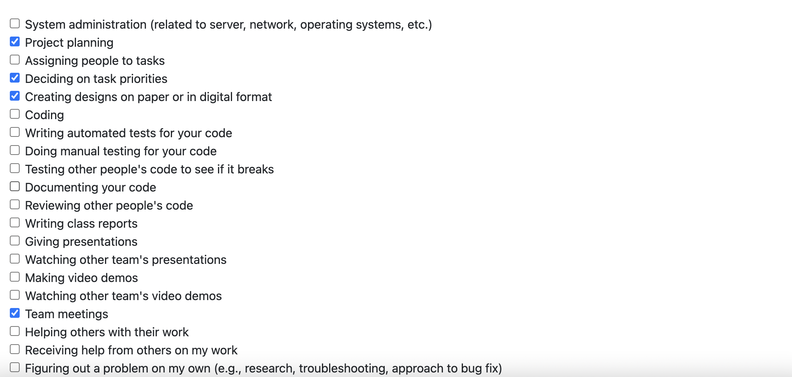

# Individual Log: Joshua Farwig (JoshFarwig) 
## Sept 24th - Oct 1st 2023 / Week 4 

Due to the nature of this week, not putting picture of task board since we didn't have any besides work on the project proposal

## Tasks Completed this week  
* Wrote MVP, User Scenarios, and Projected Tech Stack on the Project Proposal
* Discussed layout of UI with group to better understand what features we want to implement
* Discussed and refactored Tech Stack, still included somethings we weren't super sure on. 

## Tasks to Be Completed next week 
* Set up project repo
* Begin react.js / AWS Ampifily research

