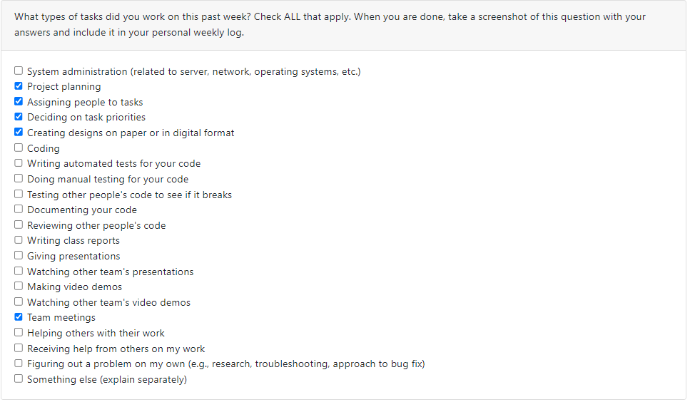

# Kyle Keim Individual Log (SN:46335485) Sept.25 to Oct.1st / Week 4
For this week, all we did was create the project plan and review/explore our options for various development tools related to AWS.

# Individual Log: Kyle Keim (kyle-keim)(SN:46335485)
## Oct 1st - Oct 8th 2023 / Week 5

## Current Goals: 
* Continue setting up the project repository.
* Work on setting up our AWS accounts and exploring functionality of said accounts.
* Begin learning/utilizing React with node JS and learning AWS amplify.
* Explore other possible AWS resources that could help us.
## Tasks Completed
1. Create a github project board and populate with project tasks.
2. Assign project board tasks to milestones.
3. Assign milestone tasks to project members.
4. Set up our AWS account

The completed tasks do not have an associated screenshot this week since they included setting up the project board and assigning tasks to individuals.
## Tasks In-Progress
1. Connect our repository to AWS Amplify for CI/CD functionality.
2. Complete our UI Design layout using Figma.
3. Installing NPM for various dependencies.

## Included Screenshot of the Current Project Board
 

 # Individual Log: Kyle Keim (kyle-keim)(SN:46335485)
## Oct 9th - Oct 22nd 2023 / Week 6-7
### Peer Review Tasks

## Previous Goals:
* Learning React JS functionality
* Finalizing UI design layout
* Learning to setup and integrate AWS Amplify services.
* Intial coding for Create Account page

## Tasks Completed
* Learning of React.JS basic functionality (Ongoing of course throughout the project.)
* Initial setup for AWS Amplify 

## Tasks In-Progress
1. Finalize UI design and layout
2. Begin coding a "Create account" page utilizing react JS

# Individual Log: Kyle Keim (kyle-keim)(SN:46335485)
## Oct 15th - Oct 29th 2023 / Week 7-8
### Peer Review Tasks

## Previous Goals:
* Initial setup for AWS Amplify 
* Learning of React.JS basic functionality (Ongoing of course throughout the project.)
* Intial coding for AWS DynamoDB, Cognito,  Amplify functionality

## Tasks Completed
* Learning of React.JS basic functionality (Ongoing of course throughout the project.)
* CLI setup for AWS Amplify 

## Tasks In-Progress
1. Continue working on UI design and coding future components and feature development.
2. Finalize and polish presentation notes/features for mini-presentation
3. Continuing coding for AWS DynamoDB, Cognito, Amplify functionality

# Individual Log: Kyle Keim (kyle-keim)(SN:46335485)
## Oct 30th - Nov 5th 2023 / Week 9
### Peer Review Tasks

## Previous Goals:
* Continue working on UI design and coding future components and feature development. 
* Finalize and polish presentation notes/features for mini-presentation
* Continuing coding for AWS DynamoDB, Cognito, Amplify functionality

## Tasks Completed
* Finalize and polish presentation notes/features for mini-presentation
* Presentation mock-up and dry runs.

## Tasks In-Progress
1. Reveiw UI design and coding future components and feature development.
2. Work on test implementation for react componenets using Cypress.
3. Continuing coding for AWS DynamoDB, Cognito, Amplify functionality

# Individual Log: Kyle Keim (kyle-keim)(SN:46335485)
## Nove 6th - Nov 12th 2023 / Week 10
### Peer Review Tasks

## Previous Goals:
* Continue working on UI design and coding future components and feature development. 
* Continuing coding for AWS DynamoDB, Cognito, Amplify functionality
* Review presentation results and adjust project planning accordingly.

## Tasks Completed
* UI Design updates and improved AWS app configurations.
* Review presentation results and adjust project planning accordingly.
* Updated/populated project board with new tasks along with task distribution.

## Tasks In-Progress
1. Reveiw UI design and coding future components and feature development.
2. Work on test implementation for react componenets using Cypress.
3. Continuing coding for AWS DynamoDB, Cognito, Amplify functionality
4. Creation of account settings panel and adding an update friends panel within it.

# Individual Log: Kyle Keim (kyle-keim)(SN:46335485)
## Nov 13th - Nov 26th 2023 / Week 11 - Week 12
### Peer Review Tasks

## Previous Goals:
* Reveiw UI design and coding future components and feature development.
* Work on test implementation for react componenets using Cypress.
* Continuing coding for AWS DynamoDB, Cognito, Amplify functionality
* Creation of account settings panel and adding an update friends panel within it.

## Tasks Completed
* Reveiw UI design and coding future components and feature development.
* Continuing documentation of coding for AWS DynamoDB, Cognito, Amplify and updating new AWS documentation.
* Updated the task distribution.

## Tasks In-Progress
* Continue updating UI design and coding future components and feature development.
* COntinue working on test implementation for react componenets using Cypress.
* Continuing coding for AWS DynamoDB, Cognito, Amplify functionality
* Continue creation of account settings panel and adding an update friends panel within it.

# Individual Log: Kyle Keim (kyle-keim)(SN:46335485)
## Nov 27th - Dec 3rd 2023 / Week 13
### Peer Review Tasks

## Previous Goals:
* Reveiw UI design and coding future components and feature development.
* Work on test implementation for react componenets using Cypress.
* Continuing coding for AWS DynamoDB, Cognito, Amplify functionality
* Creation of account settings panel and adding an update friends panel within it.

## Tasks Completed
* Reveiw/Update UI design and coding future components and feature development.
* Continuing documentation of coding for AWS DynamoDB, Cognito, Amplify and updating new AWS documentation.
* Updated the task distribution for the end of the semester.
* Video Presentation and design report.
* Creation and implementation of account page with appropriate routing. 

## Tasks In-Progress
* Continue updating UI design and coding future components and feature development.
* Continue working on test implementation for react componenets using Cypress.
* Continuing coding for AWS DynamoDB, Cognito, Amplify functionality
* Begin to implement mp4 uploading, cognito functionality, and video blurring. 
* Wrap up this semester and look forward to the next.

# Individual Log: Kyle Keim (kyle-keim)(SN:46335485)
## Dec.4th - Jan.14th 2024 / T2Week 1
### Peer Review Tasks

## Previous Goals:
* Reveiw UI design and coding future components and feature development.
* Work on test implementation for react componenets using Cypress.
* Continuing coding/learning for AWS DynamoDB, Cognito, Amplify functionality.
* Creation of account settings panel and adding an update friends panel within it.

## Tasks Completed
* Reveiw/Update UI design and coding future components and feature development.
* Continuing documentation of coding for AWS DynamoDB, Cognito, Amplify and updating new AWS documentation.
* Over the course of the winter break, learn more about AWS functionality and how to upload/edit videos in our DB.
* Creation and implementation of account page with appropriate routing. 

## Tasks In-Progress
* Continue updating UI design and coding future components and feature development.
* Continue working on test implementation for react componenets using Cypress.
* Continuing coding for AWS DynamoDB, Cognito, Amplify functionality
* Begin to implement mp4 uploading, cognito functionality, and video blurring. 
* Plan project goals for this semester and divide up the tasks.

# Individual Log: Kyle Keim (kyle-keim)(SN:46335485)
## Jan.14th - Jan.21st 2024 / T2Week 2
### Peer Review Tasks

## Previous Goals:
* Reveiw UI design and coding future components and feature development.
* Work on test implementation for react componenets using Cypress.
* Continuing coding/learning for AWS DynamoDB, Cognito, Amplify functionality.
* Creation of account settings panel and adding an update friends panel within it.

## Tasks Completed
* Reveiw/Update UI design and coding future components and feature development.
* Continuing documentation of coding for AWS DynamoDB, Cognito, Amplify and updating new AWS documentation.
* Over the course of the winter break, learn more about AWS functionality and how to upload/edit videos in our DB.
* Testing and reporting of several UI components.

## Tasks In-Progress
* Continue updating UI design and coding future components and feature development.
* Continue working on test implementation for react componenets using Cypress.
* Continuing coding for AWS DynamoDB, Cognito, Amplify functionality
* implement mp4 uploading, cognito functionality, and video blurring. 
* Plan project goals for this semester and divide up the tasks.

# Individual Log: Kyle Keim (kyle-keim)(SN:46335485)
## Jan.15th - Jan.28th 2024 / T2Week 3
### Peer Review Tasks

## Previous Goals:
* Reveiw UI design and coding future components and feature development.
* Work on test implementation for react componenets using Cypress.
* Continuing coding/learning for AWS DynamoDB, Cognito, Amplify functionality.
* Fixing queries of account settings panel and adding an update friends panel within it.

## Tasks Completed
* Reveiw/Update UI design and coding future components and feature development.
* Continuing documentation of coding for AWS DynamoDB, Cognito, Amplify and updating new AWS documentation.
* Fixing the queries for the friends list and data uploading.
  
## Tasks In-Progress
* Continue updating UI design and coding future components and feature development.
* Continue working on test implementation for react componenets using Cypress.
* Continuing coding for AWS DynamoDB, Cognito, Amplify functionality.
* implement mp4 uploading, cognito functionality, and video blurring. 
* Testing and reporting of several UI components.
* Wrting Heuristic tasks for others to try during our peer evaluation.

## General Notes
Me and Saksham did pair programming this week to get the account page and friend list functionalites working and succesfully merged with each other so
that they were operational for the heuristic evaulations next week. We merged together a few branches this week that have been seperate for awhile so
we managed to fix the merge conflicts and get a MVP ready. Currently wrting a set of heuristics for peer evaluations next week.

# Individual Log: Kyle Keim (kyle-keim)(SN:46335485)
## Jan.29th - Feb.4th 2024 / T2Week 4
### Peer Review Tasks

## Previous Goals:
* Reveiw UI design and coding future components and feature development.
* Work on test implementation for react componenets using Cypress.
* Continuing coding/learning for AWS DynamoDB, Cognito, Amplify functionality.
* Fixing queries of account settings panel and adding an update friends panel within it.

## Tasks Completed
* Reveiw/Update UI design and coding future components and feature development.
* Continuing documentation of coding for AWS DynamoDB, Cognito, Amplify and updating new AWS documentation.
* Fixing the queries for the friends list and data uploading.
  
## Tasks In-Progress
* Continue updating UI design and coding future components and feature development.
* Continue working on test implementation for react componenets using Cypress.
* Continuing coding for AWS DynamoDB, Cognito, Amplify functionality.
* implement mp4 uploading, cognito functionality, and video blurring. 
* Testing and reporting of several UI components.
* Reviewing our peer evaluation and making adjustments to our app based on given feedback.

## General Notes
This week involved writing code and heuristics for our first peer evaluation and adjusting our app based on the given feedback (That will be an ongoing set of tasks for the next couple weeks.).

# Individual Log: Kyle Keim (kyle-keim)(SN:46335485)
## Feb.5th - Feb.11th 2024 / T2Week 5
### Peer Review Tasks

## Previous Goals:
* Reveiw UI design and coding future components and feature development.
* Work on test implementation for react componenets using Cypress.
* Continuing coding/learning for AWS DynamoDB, Cognito, Amplify functionality.
* Fixing queries of account settings panel and adding an update friends panel within it.

## Tasks Completed
* Reveiw/Update UI design and coding future components and feature development.
* Continuing documentation of coding for AWS DynamoDB, Cognito, Amplify and updating new AWS documentation.
* Writing more Cypress tests for the newly implemented UI functions.
  
## Tasks In-Progress
* Continue updating UI design and coding future components and feature development.
* Continue working on test implementation for react componenets using Cypress.
* Continuing coding for AWS DynamoDB, Cognito, Amplify functionality.
* implement mp4 uploading, cognito functionality, and video blurring. 
* Testing and reporting of several UI components.
* Reviewing our peer evaluation and making adjustments to our app based on given feedback.

## General Notes
This week involved continuing writing code and heuristics for our first peer evaluation and adjusting our app based on the given feedback (That will be an ongoing set of tasks for the next couple weeks.). 
Also writing more cypress tests for the newly implemented UI functions.

# Individual Log: Kyle Keim (kyle-keim)(SN:46335485)
## Feb.12th - Feb.18th 2024 / T2Week 6
### Peer Review Tasks

## Previous Goals:
* Reveiw UI design and coding future components and feature development.
* Work on test implementation for react componenets using Cypress.
* Continuing coding/learning for AWS DynamoDB, Cognito, Amplify functionality.

## Tasks Completed
* Reveiw/Update UI design and coding future components and feature development.
* Continuing documentation of coding for AWS DynamoDB, Cognito, Amplify and updating new AWS documentation.
* Writing more Cypress tests for the newly implemented UI functions.
  
## Tasks In-Progress
* Continue updating UI design and coding future components and feature development.
* Continue working on test implementation for react componenets using Cypress.
* Continuing coding for AWS DynamoDB, Cognito, Amplify functionality.
* implement mp4 uploading, cognito functionality, and video blurring. 
* Testing and reporting of several UI components.
* Reviewing our peer evaluation and making adjustments to our app based on given feedback.
* Writing code for a chat conversation box between two individuals.

## General Notes
This week involved continuing writing code and heuristics for our first peer evaluation and adjusting our app based on the given feedback (That will be an ongoing set of tasks for the next couple weeks.). 
Also writing more cypress tests for the newly implemented UI functions. Also writing code for developing a chat conversatino feature.

# Individual Log: Kyle Keim (kyle-keim)(SN:46335485)
## Feb.19th - Mar.3rd 2024 / T2Week 7 & 8
### Peer Review Tasks

## Previous Goals:
* Reveiw UI design and coding future components and feature development.
* Work on test implementation for react componenets using Cypress.
* Continuing coding/learning for AWS DynamoDB, Cognito, Amplify functionality.
* Reviewing our peer evaluation and making adjustments to our app based on given feedback.
* Writing code for a chat conversation box between two individuals.

## Tasks Completed
* Reveiw/Update UI design and coding future components and feature development.
* Continuing documentation of coding for AWS DynamoDB, Cognito, Amplify and updating new AWS documentation.
* Writing more Cypress tests for the newly implemented UI functions.
* Reviewing our peer evaluation and making adjustments to our app based on given feedback.
* Writing code for a chat conversation box between two individuals.
  
## Tasks In-Progress
* Continue updating UI design and coding future components and feature development.
* Continue working on test implementation for react componenets using Cypress.
* Continuing coding for AWS DynamoDB, Cognito, Amplify functionality.
* implement mp4 uploading, cognito functionality, and video blurring. 
* Testing and reporting of several UI components.
* Writing out tasks for evaluators to try out in our app.
* Finalizing components for 2nd in-class peer evaluation.

## General Notes
This week involved finalizing components for the 2nd in-class peer evaluation and writing out questions/tasks for people to try with our app. Also need to fix up the cypress aumoated testing feature
so that we can improve our test writing for newly implemented UI functions. Continuing to work on the chat conversatino feature as well to get it working synchronously with our s3 buckets for videos.

# Individual Log: Kyle Keim (kyle-keim)(SN:46335485)
## Mar.4th - Mar.10th 2024 / T2Week 9
### Peer Review Tasks

## Previous Goals:
* Reveiw UI design and coding future components and feature development.
* Work on test implementation for react componenets using Cypress.
* Continuing coding/learning for AWS DynamoDB, Cognito, Amplify functionality.
* Reviewing our peer evaluation and making adjustments to our app based on given feedback.
* Finalize components for 2nd peer evaluation

## Tasks Completed
* Reveiw/Update UI design and coding future components and feature development.
* Continuing documentation of coding for AWS DynamoDB, Cognito, Amplify and updating new AWS documentation.
* Writing code for a chat conversation box between two individuals.
* Finalize components for 2nd peer evaluation.
  
## Tasks In-Progress
* Continue updating UI design and coding future components and feature development.
* Continuing coding for AWS DynamoDB, Cognito, AWS Rekognition functionality.
* implement mp4 uploading, cognito functionality, and video blurring. 
* Fixing Cypress for testing and reporting of several UI components.
* Reviewing our peer evaluation and making adjustments to our app based on given feedback.
* Writing code for a chat conversation box between two individuals.

# Individual Log: Kyle Keim (kyle-keim)(SN:46335485)
## Mar.11th - Mar.17th 2024 / T2Week 10
### Peer Review Tasks

## Previous Goals:
* Reveiw UI design and coding future components and feature development.
* Work on test implementation for react componenets using Cypress.
* Continuing coding/learning for AWS DynamoDB, Cognito, Amplify functionality.
* Finalize reviewing components/suggestions from 2nd peer evaluation

## Tasks Completed
* Reveiw/Update UI design and coding future components and feature development.
* Continuing documentation of coding for AWS DynamoDB, Cognito, Amplify and updating new AWS documentation.
* Writing code for a chat conversation box between two individuals.
* Finalize components for 2nd peer evaluation.
  
## Tasks In-Progress
* Continue updating UI design and coding future components and feature development.
* Continuing coding for AWS DynamoDB, Cognito, AWS Rekognition functionality.
* Fixing Cypress for testing and reporting of several UI components.
* Reviewing our peer evaluation and making adjustments to our app based on given feedback.
* Writing code for a chat conversation box between two individuals.
* Beginning to plan out our final video submission and report writing.

# Individual Log: Kyle Keim (kyle-keim)(SN:46335485)
## Mar.18th - Mar.24th 2024 / T2Week 11
### Peer Review Tasks

## Previous Goals:
* Reveiw UI design and coding future components and feature development.
* Work on test implementation for react componenets using Cypress.
* Continuing coding/learning for AWS DynamoDB, Cognito, Amplify functionality.
* Finalize reviewing components/suggestions from 2nd peer evaluation

## Tasks Completed
* Reveiw/Update UI design and coding future components and feature development.
* Continuing documentation of coding for AWS DynamoDB, Cognito, Amplify and updating new AWS documentation.
* Writing more fixes for the automated Cypress E2E testing..
* Finalize components for 2nd peer evaluation.
  
## Tasks In-Progress
* Continue updating UI design and coding future components and feature development.
* Continuing coding for AWS DynamoDB, Cognito, AWS Rekognition functionality.
* Fixing Cypress for testing and reporting of several UI components.
* Reviewing our peer evaluation and making adjustments to our app based on given feedback.
* Fixing bugs, looking into fixing a caching issue.
* Beginning to plan out our final video submission and report writing.

# Individual Log: Kyle Keim (kyle-keim)(SN:46335485)
## Mar.25th - Mar.31th 2024 / T2Week 12
### Peer Review Tasks

## Previous Goals:

* Continue working on test implementation for react componenets using Cypress.
* Continuing coding/learning for AWS DynamoDB, Cognito, Amplify functionality.
* Finalize reviewing components/suggestions from 2nd peer evaluation

## Tasks Completed
* Reveiw/Update UI design and coding future components and feature development.
* Continuing documentation of coding for AWS DynamoDB, Cognito, Amplify and updating new AWS documentation.
* Writing more fixes for the automated Cypress E2E testing..
* Finalize components for 2nd peer evaluation.
  
## Tasks In-Progress
* Fixing Cypress for testing and reporting of several UI components.
* Reviewing our peer evaluation and making adjustments to our app based on given feedback.
* Fixing bugs, looking into fixing a caching issue.
* Beginning to plan out our final video submission and report writing.

## General Notes
  Improving UI design and fixing the final bugs for the project, trying to figure out some caching issues and finalizing testing. Also working on the final video submission and individual reports as well.

  # Individual Log: Kyle Keim (kyle-keim)(SN:46335485)
## Apr.1st - Apr.7th 2024 / T2Week 13
### Peer Review Tasks

## Previous Goals:
* Finalize reviewing components

## Tasks Completed
* Reveiw/Update UI design and coding future components and feature development.
* Continuing documentation of coding for AWS DynamoDB, Cognito, Amplify and updating new AWS documentation.
* Finalize components for writing the individual final reports and final individual video demo.
  
## Tasks In-Progress
* Finalize our capstone project.

## General Notes
  Involves fixing minor bugs towards the end of our project and writing the individual final reports and final individual video demo.
