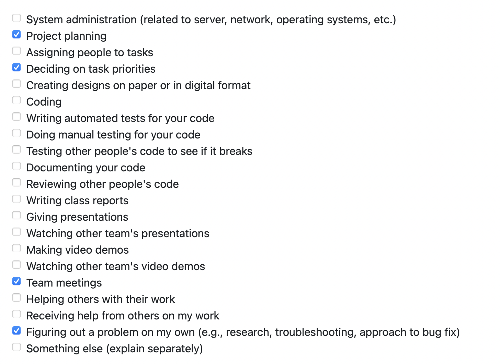

# Individual Log 5: Mac Vibert (mvibert88)

This week I participated in the following tasks:

Goals: 
- created github project board for tasks to be completed for the entire project
- assign tasks to miles stones
- assign this milestones tasks to group members
- set up aws account
- connect repo to aws amplify for ci/cd

Completed goals 1-4. We had some trouble accessing AWS services and I had to email Scott Mcmillan to get it sorted out. Our account ended up being set to the wrong region and when we switched the problems were resolved. No coding tasks started for me this week. Learning react by doing an online course. 