# Individual Log 4: Mac Vibert (mvibert88)

This week I participated in the following tasks:

This week we just worked together to come up with the project plan. We all contributed our input to decide on our tech stack, milestones and overall functionality goals and features for our project. I helped write the project plan document and contributed my input in our discussions where applicable. No coding tasks this week.

# Individual Log 5: Mac Vibert (mvibert88)

This week I participated in the following tasks:
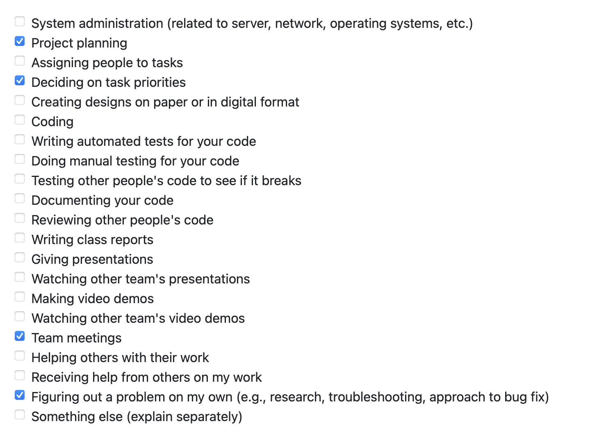

Goals: 
- created github project board for tasks to be completed for the entire project
- assign tasks to miles stones
- assign this milestones tasks to group members
- set up aws account
- connect repo to aws amplify for ci/cd

Completed goals 1-4. We had some trouble accessing AWS services and I had to email Scott Mcmillan to get it sorted out. Our account ended up being set to the wrong region and when we switched the problems were resolved. No coding tasks started for me this week. Learning react by doing an online course. 

# Individual Log 6-7: Mac Vibert (mvibert88)

This week I participated in the following tasks:
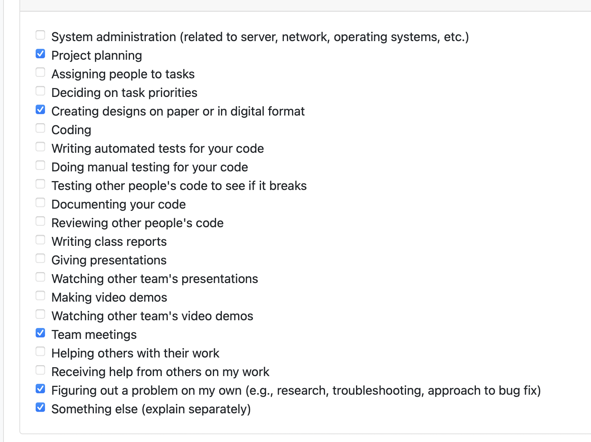 

Goals:
- Get amplify working on aws
- Start learning react 

This week I completed my goals. We worked with Bowen to fix a problem with giving AWS access to our github repo. I started learning react as it is what we chose to use for our frontend framework. I bought an online course and I'm working through it. Still no actual coding tasks for me, hoping to start coding next week and work on the login page! 

# Individual Log 8: Mac Vibert (mvibert88)

This week I participated in the following tasks:
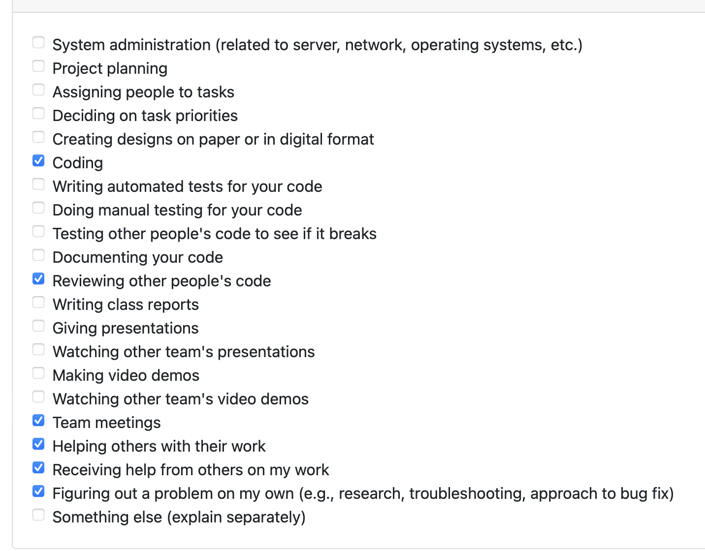 

Goals:
- setup cognito loping with lambda function to send user credentials to db 

I didn't accomplish my goal this week. Been a struggle. Spent many hours debugging trying to get lambda function to trigger and send signup info to database. My groupmates are also trying to accomplish the same thing with no success. It's a hard problem to solve because there's so console errors or stack trace. Not too much documentation to help and a lot of solutions are deprocated. Hopefully we'll figure it out soon. 

 

# Individual Log 9: Mac Vibert (mvibert88)

This week I participated in the following tasks:
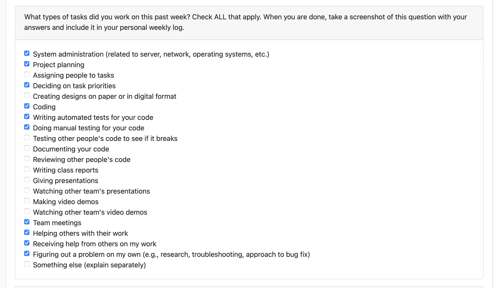 

Goals: 
- get login with lambda function to send user data to database 
- start automated tests for frontend 

This week we got our cognito login working as well as getting our lambda function working to send user info to the database. I help with all parts of this coding. I also started to build a test suite for automated front end tests with python and selenium. I think I'm going to scrap this as we are going to do all our testing through cypress which is much more streamlined. I think our first product demo went well! Starting to code frontend and setup cypress testing next week.

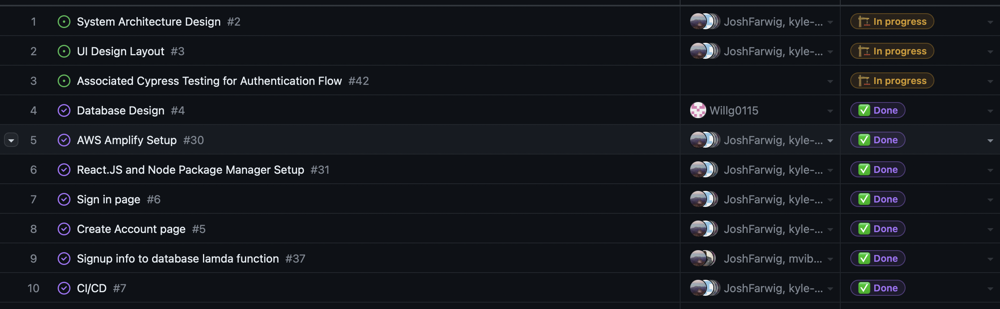 

# Individual Log 10: Mac Vibert (mvibert88)

This week I participated in the following tasks:
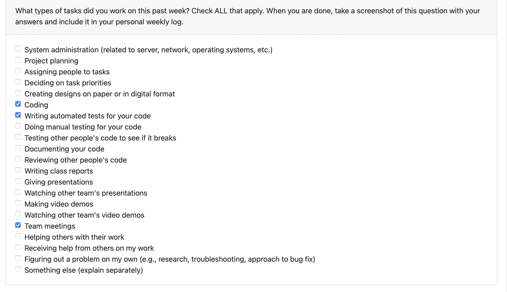 

Goals: 
- setup cypress testing

Slow week this week. I started to setup the cypress test suite and migrate our QA efforts to cypress. Going well so far. This week gonna have much more time to integrate testing and actually implement testing for all our components so far. Side note, I noticed I didn't get marks for log last week but I did it. It should have been in repo before the thing maybe my teammates didn't approve my pr in time? If you can, please give me marks for last week, thank you! 

This week I participated in the following tasks:

 

# Individual Log 12: Mac Vibert (mvibert88)

This week I participated in the following tasks:
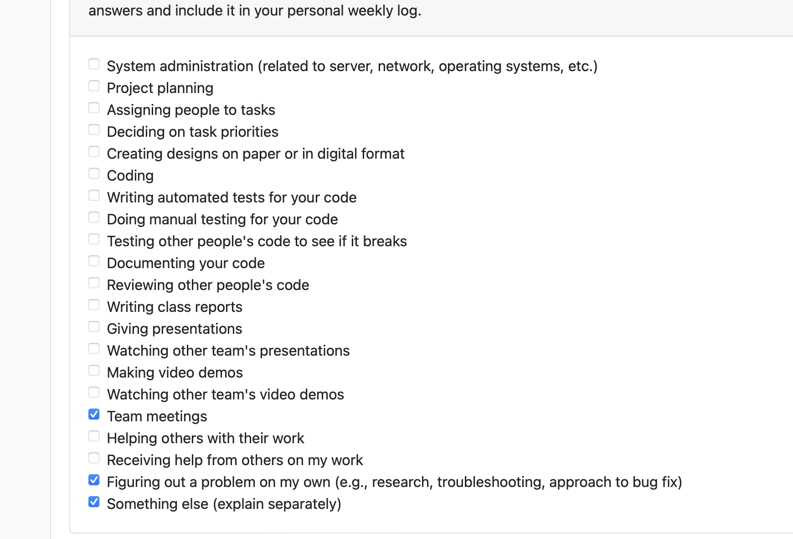

Goals: 
- Update to full database schema and make sure login and lambda function still work
- Learn React

This week will and I got the new schema setup on our dev branch called "aws-dev-test-josh". Should probably merge that into a dev branch. Other than that I haven't done any programming this week, I've just been taking the time to learn react, how it works, how to route components etc. Will start making some components (features for milestone) this week. Will also start testing the componants as they are being made. I have watched a 6 hour video going through Facebook's docs on react and learned a lot. Ready to start coding this week. Since I didn't code at all there's no git activity to report. 

# Individual Log 13: Mac Vibert (mvibert88)

This week I participated in the following tasks:
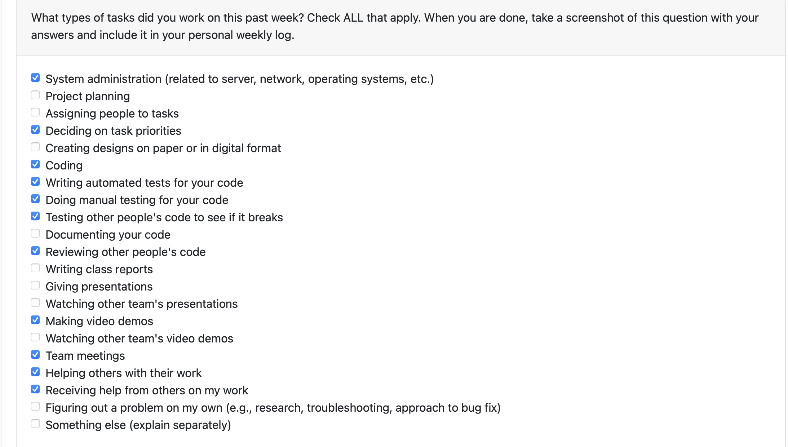

Goals:
- Setup apollo client
- Get friend context funtional 
- Chatview based on friend context
- Component tests 
- e2e testing
- milestone doc and video

This week was crazy busy. Excuted on a lot of stuff I learned last week. Got the apollo client setup and connected to our graphql so we can query and cache data with on the client. I then setup up a friend context and built the chatview component so it changes to reflect the user you are chatting with. Will and I worked together a lot this week to get tests build for all our components and started the e2e testing. Also spent a lot of time reorgazing files, refactoring and transferring code from Josh's old branch's. Been kinda slow on our implementation because this whole tech stack is new and I've spent a lot of time reading documentation and learning from vieos. I feel like I'm getting the hang of things well now and I'm looking forward to the next term. Will and I also prepared our milstone doc and made our demo video. 

# Individual Log T2 W1: Mac Vibert (mvibert88)

This week I participated in the following tasks:
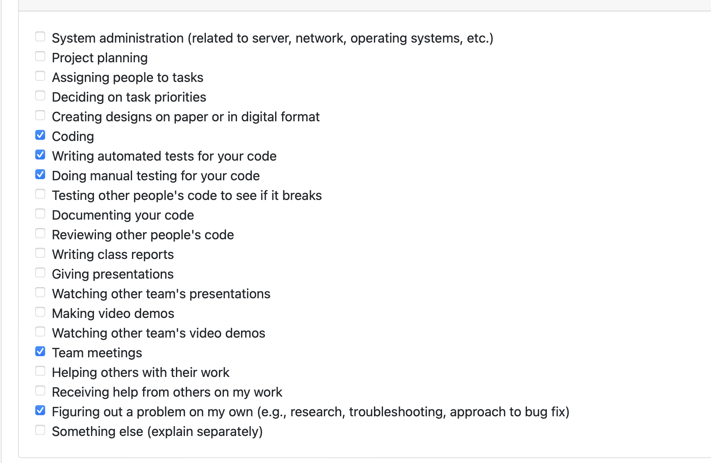

Goals:
- create and test picture upload form popup

This week I spent a lot of time figuring out how to build a modal and then created one with the picture upload form for our chatview section. I wanted to get the automated component tests up for these new components but I had some bundler issues that I spent hours trying to resolve and couldn't fix with cypress so I wasn't able to write and compile my tests so I just tested my features manually ad reported results on a spreadsheet. Hopefully can resolve this cypress issues this coming week so we can keep automating our testing process. 

 

#### My test report for my new popup feature 

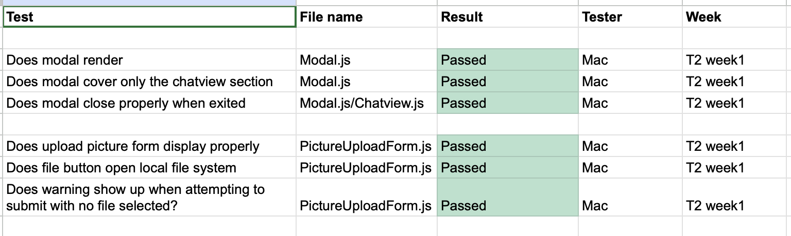 

# Individual Log T2 W2: Mac Vibert (mvibert88)

Goals:
- fix cypress
- Get files uploading to aws s3 bucket

Tasks: 

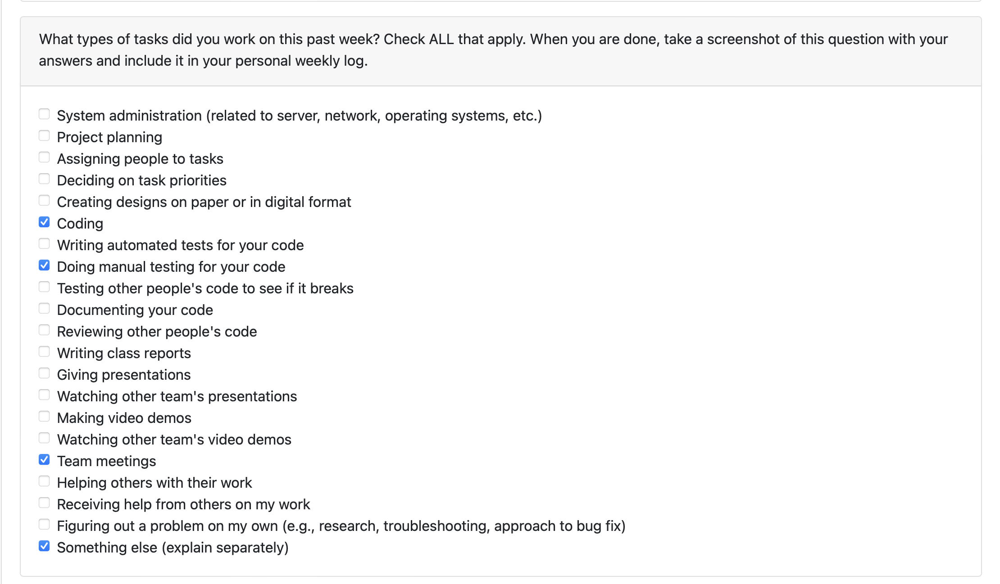

This week I started by trying to fix our cypress suite. Since will refactored a bunch of stuff which would change a lot of our component test files I decided that we should refactor everything and reconfigure all our component tests. The end to end test scripts will remain the same so we can reuse those. This coming week once everything is refactored properly and we're happy I'll redo the automated component testing. 

This week I battled with file uploads for way longer than I should have. The documentation on the Amplify Dev Center website regarding storage is not up to date. I expected it to be so I struggled trying to use the packages used in the docs for HOURS. Lots of investigation led me to discorver that the uploadData function they tell you to use is deprocated and that's the reason I had so many package errors and API call errors when tryin to compile my code. Once I switch to the up to date method which was hard to find and not in their official docs for some reason, I got it to work. Now files are sent to our aws s3 bucket so we can start setting up recognition. This was super frustrating and took way too much time but it felt good when things started working. Next week I'll start setting up a lambda function to grab the photos from our bucket and run them through recognition for face blurring. 

#### Maunal test for file upload
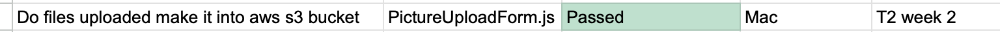 

# Individual Log T2 W3: Mac Vibert (mvibert88)

Goals:
- merge feature branches to one branch for development
- Start setting up face blurring functionality

Tasks: 

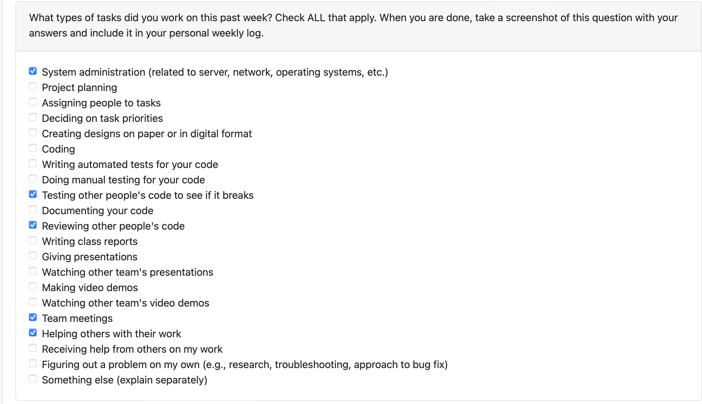

This week was pretty slow for me. Was working on AWS console trying to get a lambda trigger setup to run a serverless face blurring function. Did not get very far as there is not a whole lot of documentation on how to implement this with an amplify based application. Unfortunately not super productive but will put in a good effort next week. 

# Individual Log T2 W4: Mac Vibert (mvibert88)

Goals:
- Setup face blurring pipeline for pictures

Tasks: 

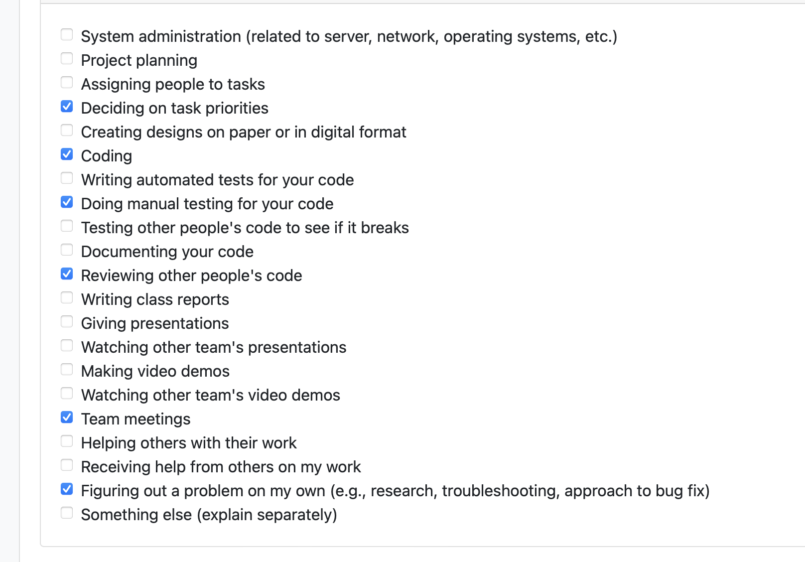

This week I implemented the full photo blurring pipeline at the start of the week. Setup the lambda function, s3 buckets, and send and polling logic for video upload and retieval. There is now a loading icon when blurring and the blurred picture is returned to the form to be previewed. I also started setting up encrypted file keys so we can start using the database to properly load files relative to conversations. Will me helped a bit with this (pair programmed) as well and also fixed and refactored Kyle and Saksham's broken features. He deserves some bonus marks this week. 

Cypress suite is still bugged and we didn't want to waste too much time getting it back up so we're just manual testing new code for this week. Gonna have to build the automated test suite from scratch. 

# Individual Log T2 W5: Mac Vibert (mvibert88)

Goals:
- Setup shared video logic. 
- implement sharring blurred pictures through chats

Tasks: 

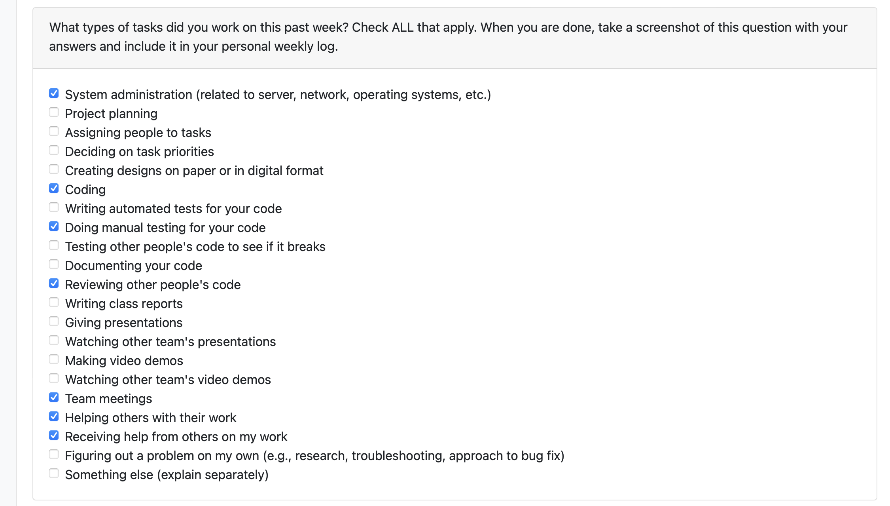

This week I worked with Will to implement sharing files through the chat view. We pair programmed (will made commits). We got the mutation working to add videoMessage elements to the table contaitaing file keys for s3 and the user and receiver creds. Manually tested all our implementaions before making any commits. Another productive week! 

