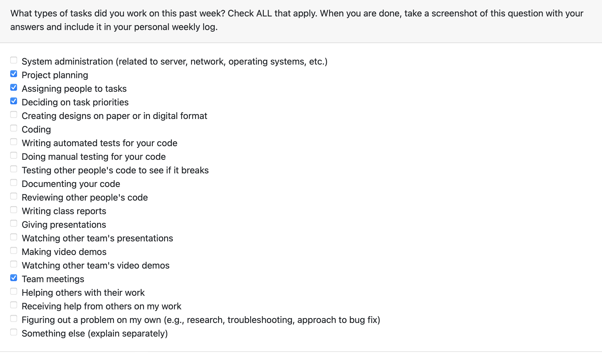
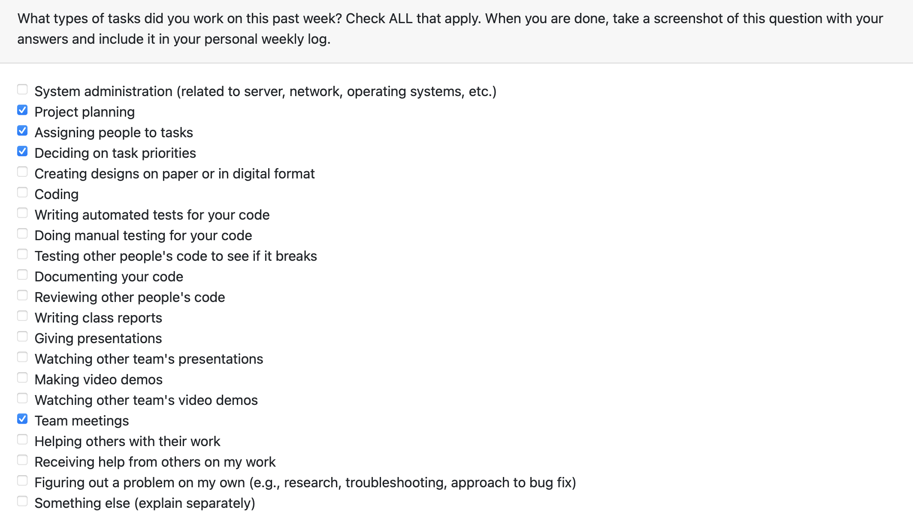

# Individual Log for Week4: Saksham Rana (sakshamrana7)

During this week, we collaborated to formulate the project plan. Each team member contributed their insights to determine the technology stack, establish milestones, and outline the project's overarching objectives and features. This week was focused on planning, and there was no coding.

## Week 5

Goals: 
- set up AWS account
- connected repo to aws amplify for ci/cd
- Team meetings for coding environment

**Tasks**

