# Individual Logs for: Saksham Rana (sakshamrana7)

## Week 4 (Sept 24th - Oct 1st 2023)

**Goals:**
During this week, we collaborated to formulate the project plan. Each team member contributed their insights to determine the technology stack, establish milestones, and outline the project's overarching objectives and features. This week was focused on planning, and there was no coding.

**Tasks**

## Week 5 (Oct 1st - Oct 8th 2023)

**Goals:**

- set up AWS account
- connected repo to aws amplify for ci/cd
- Team meetings for coding environment

**Tasks**

## Week 6 & 7 (Oct 8st - Oct 22nd)

**Goals:**

- AWS account setup completed (delay due to email issue)
- connecting to aws amplify for ci/cd
- Learning React

**Tasks**

## Week 8 (Oct 22nd - Oct 29th)

**Goals:**

- AWS cognito setup
- Team meeting for presentation
- Learning React

**Tasks**

## Week 9 (Oct 29th - Nov 5th)

**Goals:**

- Mini Presentation
- Amplify React UI
- Team meetings for next milestones

**Tasks**
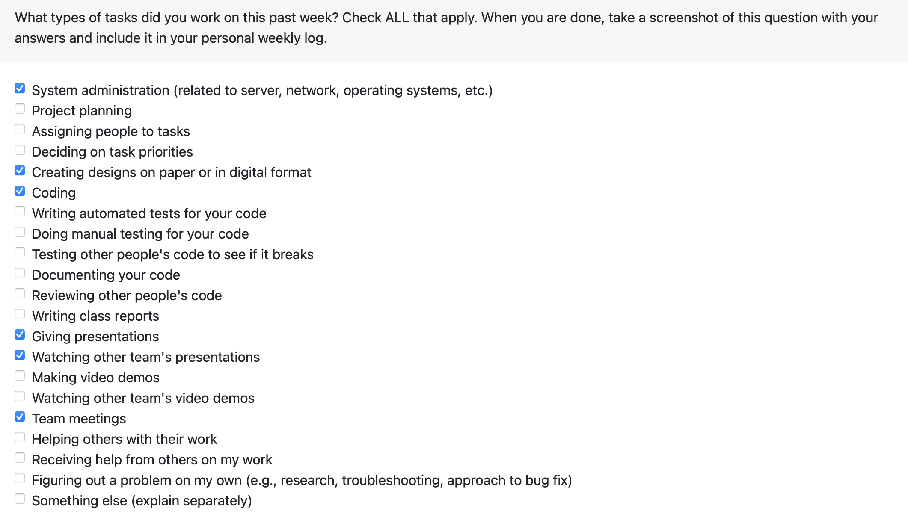

## Week 10 (Nov 5th - Oct 12th)

**Goals:**

- Designing of Edit profile
- Team meetings

**Tasks**
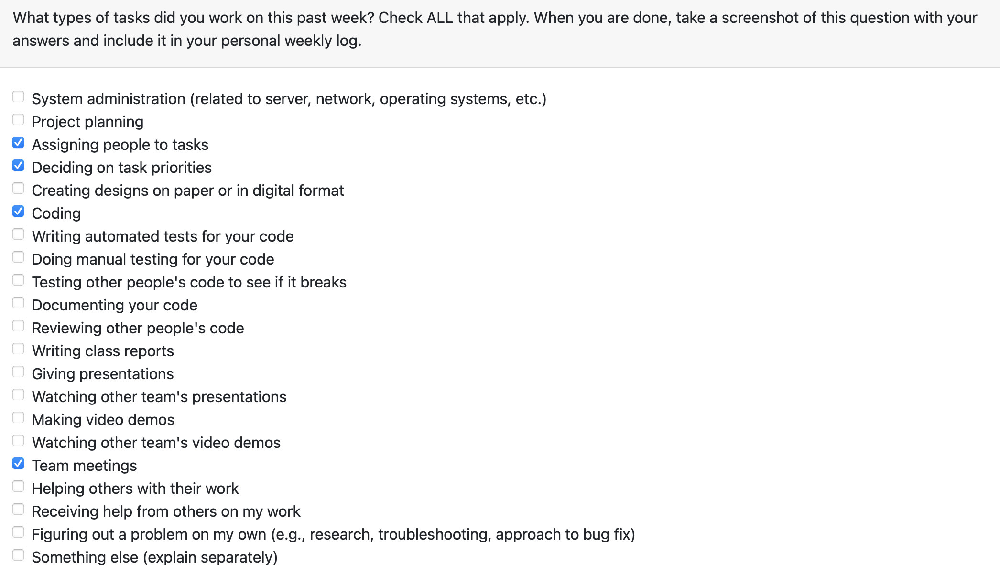

## Week 12 (Nov 19th - Nov 26th)

**Goals:**

- Front end form for Edit profile
- Learning React and integrating it with AWS amplify

**Tasks**
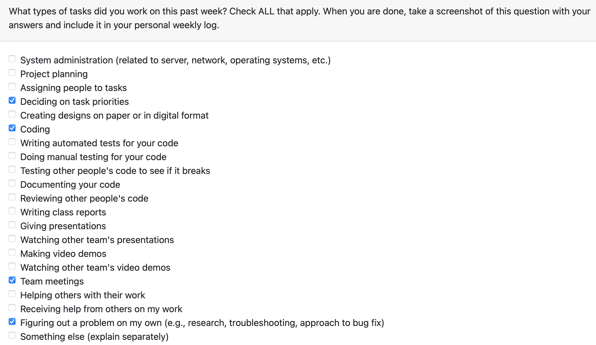

## Week 13 (Nov 26th - Dec 3rd)

**Goals:**

- Routing and integrating the pages for a user friendly flow
- Fix issues with sending friend request
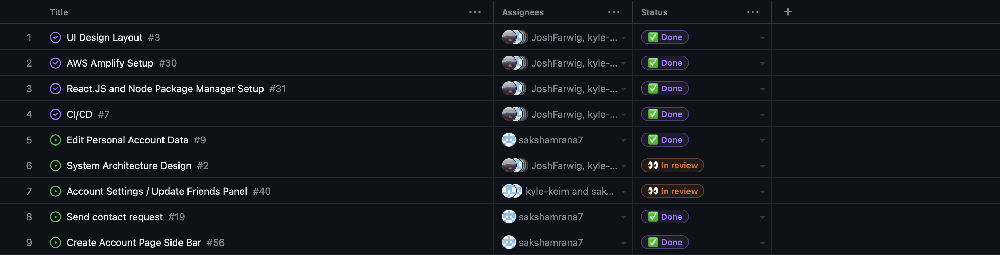

This week I created functional react components for the account page of our app such as a account page side bar to add friends and edit profile form. The account page side bar contains a button which on pressing opens a search by email option for the users. I made the edit profile form where user can edit their name and email.

**Tasks**
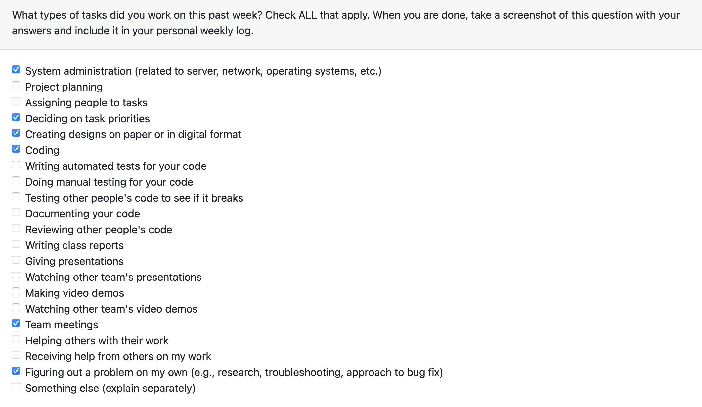

## Term 2 Week 1 (Jan 7th - Jan 14th)

This week I participated in the following tasks:
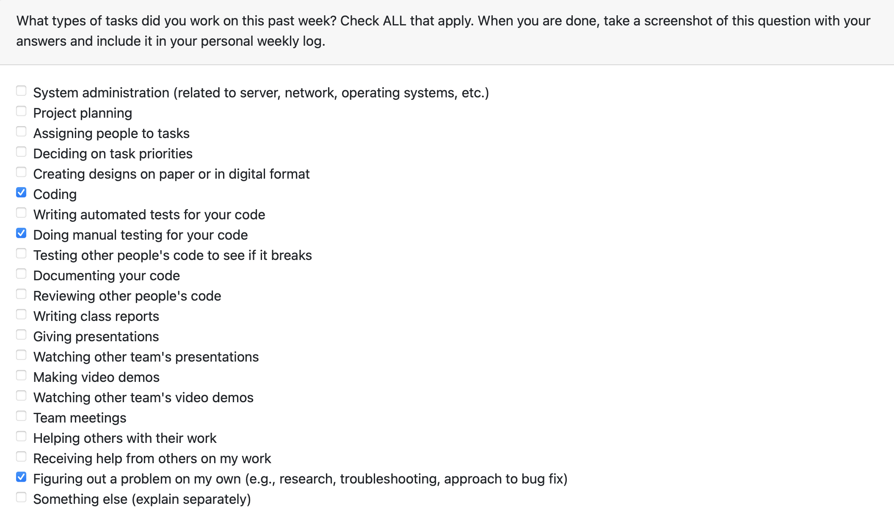

Goals:

- Solve the issues in Edit Profile and Add Friend features.
- Learn about apollo client in order to integrate it in all assigned features
- Writing manual testing code for edit profile
- Work on next task this week and solve issue with sending friend request: forgot password feature

## Term 2 Week 2 (Jan 14th - Jan 21st)

This week I participated in the following tasks:

Goals:

- forgot password feature works, there was no hard coding required for this feature.
- Solve Configuration issues 

Upcoming Week:

- As soon as we are able to fix the issue, the account functionality will be working including Add Friend. We will be working on video recognition feature as that is one of the major feature we are left with.

I have been encountering configuration issues and I have tried to reconfigure my system but it did not help. My team mate Mac thinks it's an issue with env and we will try to sort it on Tuesday and hopefully it will work so that I can test my code and test my features as it has been frustrating to face these issues as it is hindering my ability to test the code.
Here are the screenshots of code compilation/issues!
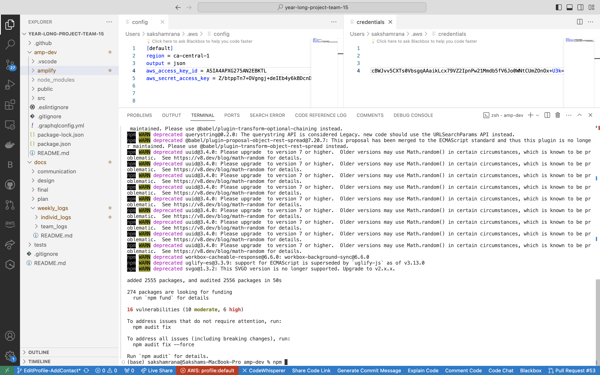
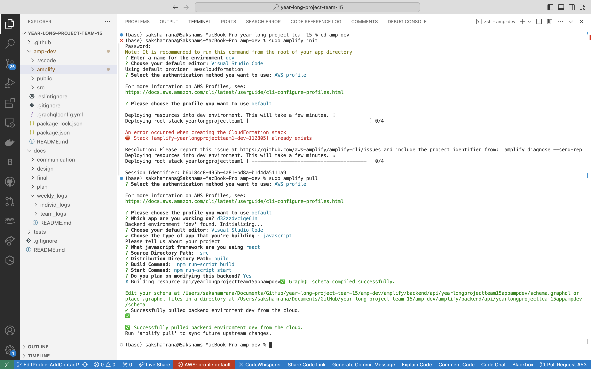
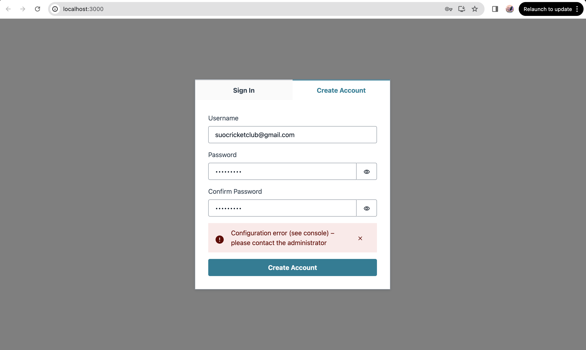

## Term 2 Week 3 (Jan 21st - Jan 28th)

This week I participated in the following tasks:
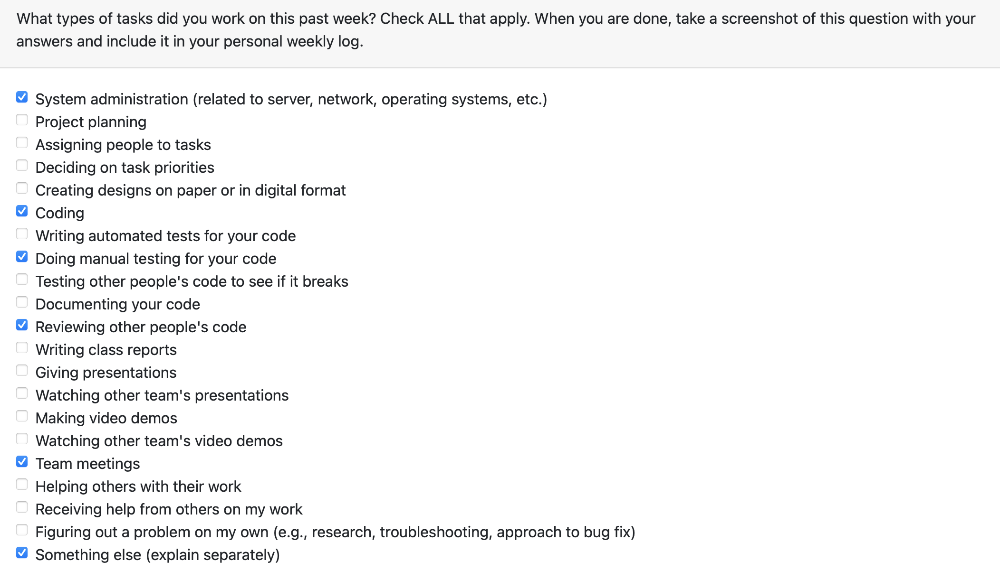

Goals:

- Sending Friend Request feature works
- New Modal named as AddFriendModal.js added for popup window
- Changed UI for better user interaction for Sending Friend Request Feature
- Solved Configuration issues.

Upcoming Week:

- Work on the project and look for exception or error cases in order to have a smooth running project for Peer-testing. Help the team with any other possible feature that needs to be implemented before peer testing.
- Work on the UI.

## Term 2 Week 4 (Jan 28th - Feb 4th)

This week I participated in the following tasks:
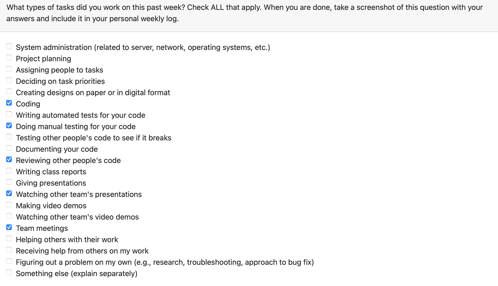

Goals:

- Prepared Questionaire for peer-testing
- Add Profile feature implemented, which includes uploading the profile picture to the s3 bucket in profile picture folder with unique name for each user.
- Retrieving and displaying the profile picture (need to give permissions for GET from S3 bucket)
- Work on UI changes as per peer-testing suggestions

Upcoming Week:

- Work on the project and look for exception or error cases in order to have a smooth running project and fix the changes as per the suggestions given in peer testing.
- Work on the UI.

