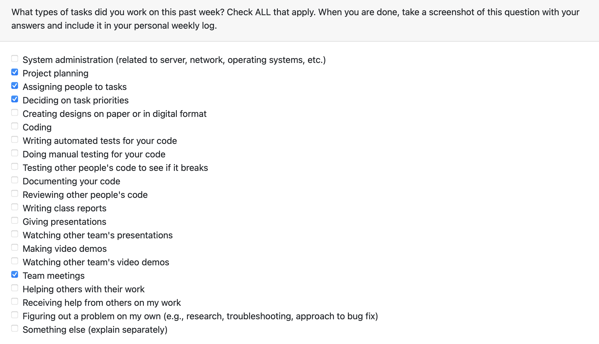

# Individual Logs for: Saksham Rana (sakshamrana7)

## Week 4 (Sept 24th - Oct 1st 2023)

**Goals:**
During this week, we collaborated to formulate the project plan. Each team member contributed their insights to determine the technology stack, establish milestones, and outline the project's overarching objectives and features. This week was focused on planning, and there was no coding.

**Tasks**

## Week 5 (Oct 1st - Oct 8th 2023)

**Goals:**

- set up AWS account
- connected repo to aws amplify for ci/cd
- Team meetings for coding environment

**Tasks**

## Week 6 & 7 (Oct 8st - Oct 22nd)

**Goals:**

- AWS account setup completed (delay due to email issue)
- connecting to aws amplify for ci/cd
- Learning React

**Tasks**

## Week 8 (Oct 22nd - Oct 29th)

**Goals:**

- AWS cognito setup
- Team meeting for presentation
- Learning React

**Tasks**

## Week 9 (Oct 29th - Nov 5th)

**Goals:**

- Mini Presentation
- Amplify React UI
- Team meetings for next milestones

**Tasks**

## Week 10 (Nov 5th - Oct 12th)

**Goals:**

- Designing of Edit profile
- Team meetings

**Tasks**

## Week 12 (Nov 19th - Nov 26th)

**Goals:**

- Front end form for Edit profile
- Learning React and integrating it with AWS amplify

**Tasks**

## Term 2 Week 1 (Jan 7th - Jan 14th)

This week I participated in the following tasks:

Goals:

- Solve the issues in Edit Profile and Add Friend features.
- Learn about apollo client in order to integrate it in all assigned features
- Writing manual testing code for edit profile
- Work on next task this week and solve issue with sending friend request: forgot password feature
