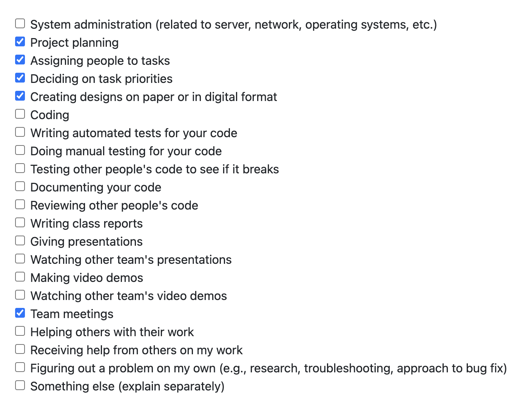
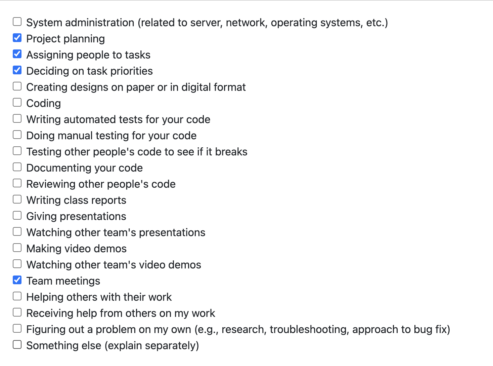
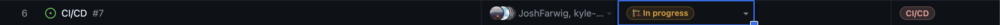
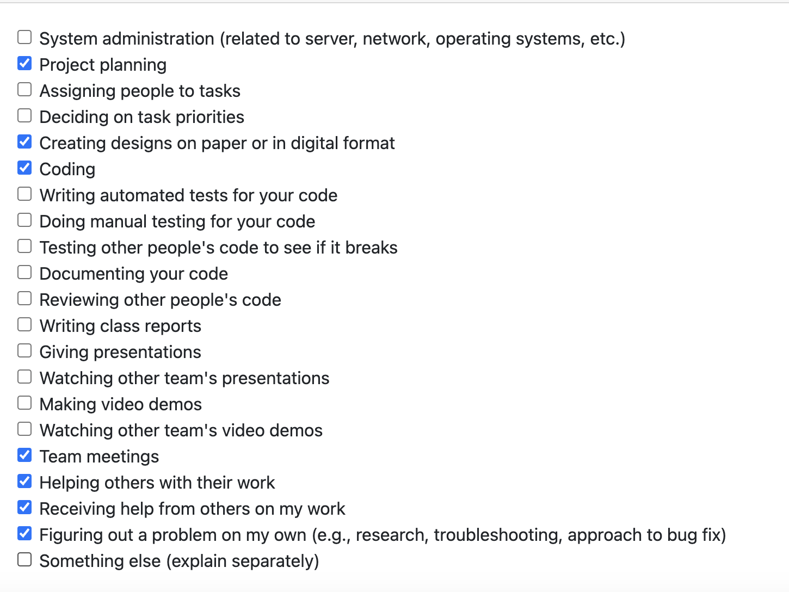
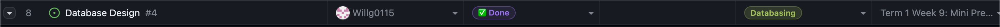

# Individual Log: Will Garbutt (Willg0115)

## Week 4

This week I helped complete the project plan as well as working on some design elements of the project

## Week 5

Goals: 
- created github project board for tasks to be completed for the entire project
- assign tasks to miles stones
- assign this milestones tasks to group members
- set up aws account
- connect repo to aws amplify for ci/cd

**Tasks**

Completed tasks 1-4. I am not including a screenshot of completed tasks as only task 5 is on project board and was not done.

## Week 6/7

Goals: 
- learn React js
- learn graphQl (defining schema)
- use amplify studio to generate backend and react components for authentication connected with data model
- design database structure

**Tasks**

I have completed some React intro courses and watched some videos. I completed the database ER diagram and watched some videos on graphQL to translate the diagram to a graphGL schema and integrated it into amplify studio so it could use the data model to build some react components. 

**In Progress**

**Done**

