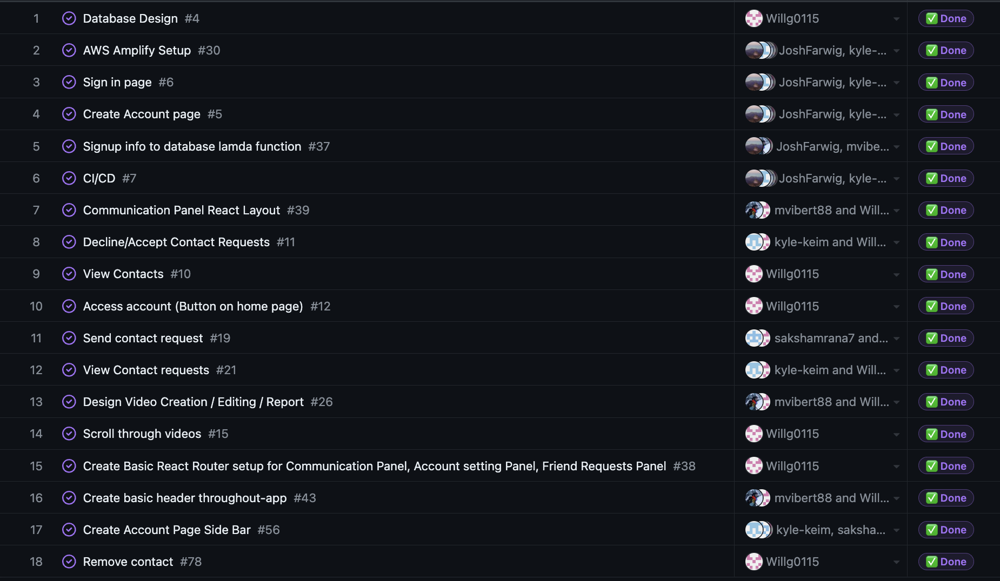

# Individual Log: Will Garbutt (Willg0115)

## Week 4

This week I helped complete the project plan as well as working on some design elements of the project

## Week 5

Goals: 
- created github project board for tasks to be completed for the entire project
- assign tasks to miles stones
- assign this milestones tasks to group members
- set up aws account
- connect repo to aws amplify for ci/cd

**Tasks**

Completed tasks 1-4. I am not including a screenshot of completed tasks as only task 5 is on project board and was not done.

## Week 6/7

Goals: 
- learn React js
- learn graphQl (defining schema)
- use amplify studio to generate backend and react components for authentication connected with data model
- design database structure

**Tasks**

I have completed some React intro courses and watched some videos. I completed the database ER diagram and watched some videos on graphQL to translate the diagram to a graphGL schema and integrated it into amplify studio so it could use the data model to build some react components. 

**In Progress**

**Done**

## Week 8

Goals:

finish linking cognito user pool sign up to our database.

**Tasks**

This week myself and the team spent alot of time trying to get a lambda trigger to update our database after a user signs up with aws cognito services. So far sign up with verification and sign in forms display properly  and are functional and users can sign out, however lambda function is not updating the database. 

**In Progress**

## Week 9

Goals:

finish linking cognito user pool sign up to our database (lambda function) annd be ready for mini- presentations.

**Tasks**

This week I helped get the lambda function working properly to add users signed up from the cognito user pool to the DB and got ready for the mini-presentation.

**In Progress**

**Done**

## Week 10

Goals:

For this week and future weeks up to the next milestone, our goals are to integrate all UI elements into our app and hopefully some functionality.

**Tasks**

This week was very busy for myself, I had 3 midterms and a team assessment test so I was unfortunatly unable to make any commits to the project.

**In Progress**

**Done**

## Weeks 11 and 12

Goals:

For this week and future weeks up to the next milestone, my goals are to integrate  UI elements into our app with functionality and work on the design document and demo vid.

**Tasks**

This week I worked on creating react componets for the main communication panel page of our app such as a header, sidebar to view contacts and a simple form to be used to upload a video.

**In Progress**

**Done**

## Week 13

Goals:

For this week my goals are to finish integrating UI elements into our app with functionality that I started on and complete the design document and demo vid with Mac.

**Tasks**

This week I created functional react components for the main communication panel page of our app such as a header and the sidebar to view contacts. I set up the routing of our app to have a main page and an account page. Doing so I had to refactor some components. The header does the page routing and the side bar shows the users friends list and can search friends by string pattern. I also fixed some design layout/sizing issues with the UI and set up our cypress testing pipline with Mac. Mac and I also completed the design doc and demo vid for this design milestone.

**In Progress**

**Done**

# Term 2

## Week 2

Goals:

For this week my goal is to look into and start working on video processing as well as doing some refactoring on my previous components.

**Tasks**

This week I was driving accross the country to Ontario (Will be back in BC just had to do this for some personal reasons). Because of this i was only able to get my refactoring done.

**In Progress**

- video processing

**Done**

## Week 3

Goals:

For the week my goal is to research and start developing our instant messaging feature as well as prepare for peer evaluations next week

**Tasks**

This week I prepped for the peer eval with my team, getting questionarries and planning our hueristic evaluations. Mainly i focused on researching methods and implementations for our instant messaging feature. However, our team has now faced a roadblock with this feature. To complete it we would need to either edit our database schema and update our backend to handle the messages but would then encounter problems displaying videos and messages in proper order on the chat window. Or we keep it as a separate service and would have two seperate windows, one for videos and one for text messages. Since both of these require large design changes and problems we are deciding to leave out this feature for now and focus on our other more important features like video processing so we can deliver our MVP. The instant messaging feature was added on later in the project and was not part of our MVP. 

**In Progress**

- Peer Evaluation prep
- X to insant messaging
- continuing video processing

**Done**

## Week 4

Goals:

for this week my goall is to finish prepping for peer testing including heuristic evaluations and image processing for another feature to demo and recieve feedback

**Tasks**

this week I was tasked with completing prep with teamates for peer testing. I pair programmed with Mac to get our image proccessing working and we completed that. After peer testing I decided to fix and refactor alot of our old code for better and more correct functionality. This included fixing and completeing displaying and accepting/declining friend requests by adding and changing as well as refactoring for better code quality. I also did the same with our sending friend requests functionality. This included adding more logic to avoid cases of sending fried requests to users who already have or sent a request or are already friends as well as making some design changes to the ui of this component which were decided from peer testing feedback. I also made some other small UI changes as per peer feedback. I believe I did alot this week so if you could check my commits and see if I deserve bonus marks that would be great.

**In Progress**

Now in progress is More UI fixes and changes to address peer feedback and to work on video processing with Mac. We started with Image proccessing first to get the structure and proof of concept down and we are now likely going to include that feature as well as video proccessing.

**Done**

## Week 5

Goals:

my goals for this week is to work on the back end logic for sending and fetching video messages.

**Tasks**

This week I added a feature where users are able to remove friends. while doing this I discovered a bug with the sending friends requests list from some asynchronous clashes and fixed that issue. Mac and I pair programmed the logic for sending video messages and adding to the database and I continued to display them in the users chat view. 

**In Progress**

From what I/we did this week there are just some holes to fill with regards to refreshing automatically and other dynamics for a smoother user experience that will be addressed.

**Done**

## Week 6/7

Goals:

work on video proccessing, real time chatting

**Tasks**

This week Ive spent alot of time trying to get video messages to update in real time without refresh. However, I am going to have to keep working on this as it is not yet working despite my efforts of uing websocket connections and graphql subsrciptions. May try polling for data instead in next attempt. I also add chat messages to our app including database altering and logic for sending a chat and updated fetching and  conditional rendering for display of video/picture messages as well as chats. I also fixed issues with friend context so when switching pages and returning to a previous page, the context holds whatever frined you were chatting with so you dont have to find your last conversion again. I also spent some time completely re-designing and fixing some bugs with our new login/signup pages.

**In Progress**

- video proccessing
- real-time chatting

**Done**

## Week 8

Goals:

complete video proccessing and real time chatting

**Tasks**

this weke I completed realtime chat and content messaging and worked with mac to set up the video processing pipeline and implememnting video upload and incorporate them with our chatting functions. we just have an issue with the way AWS uploads to s3 for the pipline to grab and process the videos. I also added a filtering feature so users can filter there conversations by date or only display picture/video messages (filter out chat messages).

**In Progress**

- fix bug with amplify and s3 working together with video processing pipline.

**Done**

## Week 9

Goals:

complete video proccessing 

**Tasks**

This week I completed peer testing and continued to try and debug a problem we are having when the app triggers the video-processing pipeline.

**In Progress**

- fix bug with amplify and s3 working together with video processing pipline.

**Done**

## Week 10

Goals:

- complete video proccessing 

**Tasks**

This week Mac fixed our bug with the video proccessing so I was able to correct and add the displaying of videos and paybak window.

**In Progress**

- implemented peer testing feedback 

**Done**

## Week 11

Goals:

- work on bugs and improvements on user experience including perrtesting feedback.

**Tasks**

this week i started fixing bug/improving UX, some of which is based on peer feedback. So far I have done small things like changing the filtering labels to be more clear and highlighting the name of the friend the user has selected the conversation for. I spent most of my time trying to fix asyncrohnous updates when a friend is added and deleted. so far I have gotten the Friends list on the account page to update when a friend is deleted and clear the context if that friend was previously selected for conversation. I am having trouble making these updates push to other pages and not just the page that the action was done. I also updated the adding a friend feature so that this list of users that you can add only populates based on what you search so all potential users arent listed at once.

**In Progress**

- continue bug fixes and enhancing user experience

**Done**

## Week 13

This week I worked on my final report and video demo and merged branches with team.
