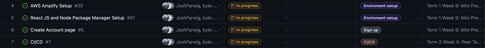
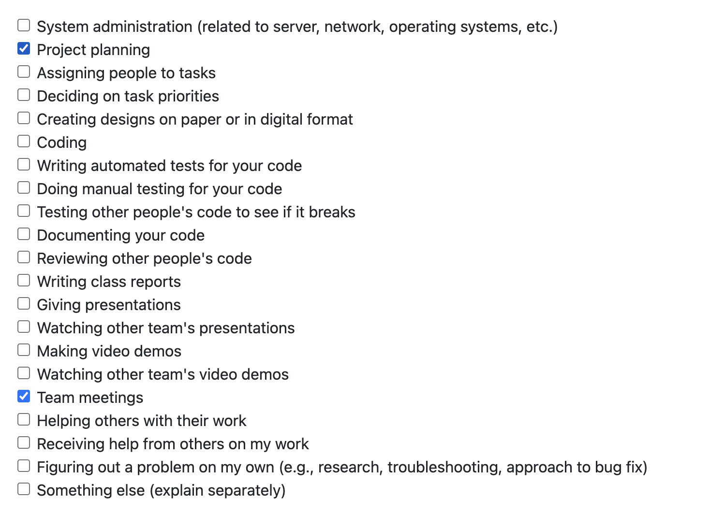
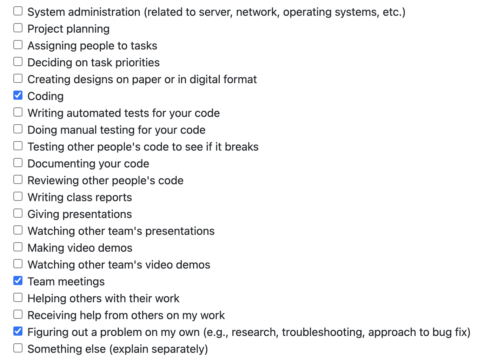

# Individual Log: Will Garbutt (Willg0115)

## Week 4

This week I helped complete the project plan as well as working on some design elements of the project

## Week 5

Goals: 
- created github project board for tasks to be completed for the entire project
- assign tasks to miles stones
- assign this milestones tasks to group members
- set up aws account
- connect repo to aws amplify for ci/cd

**Tasks**

Completed tasks 1-4. I am not including a screenshot of completed tasks as only task 5 is on project board and was not done.

## Week 6/7

Goals: 
- learn React js
- learn graphQl (defining schema)
- use amplify studio to generate backend and react components for authentication connected with data model
- design database structure

**Tasks**

I have completed some React intro courses and watched some videos. I completed the database ER diagram and watched some videos on graphQL to translate the diagram to a graphGL schema and integrated it into amplify studio so it could use the data model to build some react components. 

**In Progress**

**Done**

## Week 8

Goals:

finish linking cognito user pool sign up to our database.

**Tasks**

This week myself and the team spent alot of time trying to get a lambda trigger to update our database after a user signs up with aws cognito services. So far sign up with verification and sign in forms display properly  and are functional and users can sign out, however lambda function is not updating the database. 

**In Progress**

## Week 9

Goals:

finish linking cognito user pool sign up to our database (lambda function) annd be ready for mini- presentations.

**Tasks**

This week I helped get the lambda function working properly to add users signed up from the cognito user pool to the DB and got ready for the mini-presentation.

**In Progress**

**Done**

## Week 10

Goals:

For this week and future weeks up to the next milestone, our goals are to integrate all UI elements into our app and hopefully some functionality.

**Tasks**

This week was very busy for myself, I had 3 midterms and a team assessment test so I was unfortunatly unable to make any commits to the project.

**In Progress**

**Done**

## Weeks 11 and 12

Goals:

For this week and future weeks up to the next milestone, my goals are to integrate  UI elements into our app with functionality and work on the design document and demo vid.

**Tasks**

This week I worked on creating react componets for the main communication panel page of our app such as a header, sidebar to view contacts and a simple form to be used to upload a video.

**In Progress**

**Done**

## Week 13

Goals:

For this week my goals are to finish integrating UI elements into our app with functionality that I started on and complete the design document and demo vid with Mac.

**Tasks**

This week I created functional react components for the main communication panel page of our app such as a header and the sidebar to view contacts. I set up the routing of our app to have a main page and an account page. Doing so I had to refactor some components. The header does the page routing and the side bar shows the users friends list and can search friends by string pattern. I also fixed some design layout/sizing issues with the UI and set up our cypress testing pipline with Mac. Mac and I also completed the design doc and demo vid for this design milestone.

**In Progress**

**Done**

# Term 2

## Week 2

Goals:

For this week my goal is to look into and start working on video processing as well as doing some refactoring on my previous components.

**Tasks**

This week I was driving accross the country to Ontario (Will be back in BC just had to do this for some personal reasons). Because of this i was only able to get my refactoring done.

**In Progress**

- video processing

**Done**

