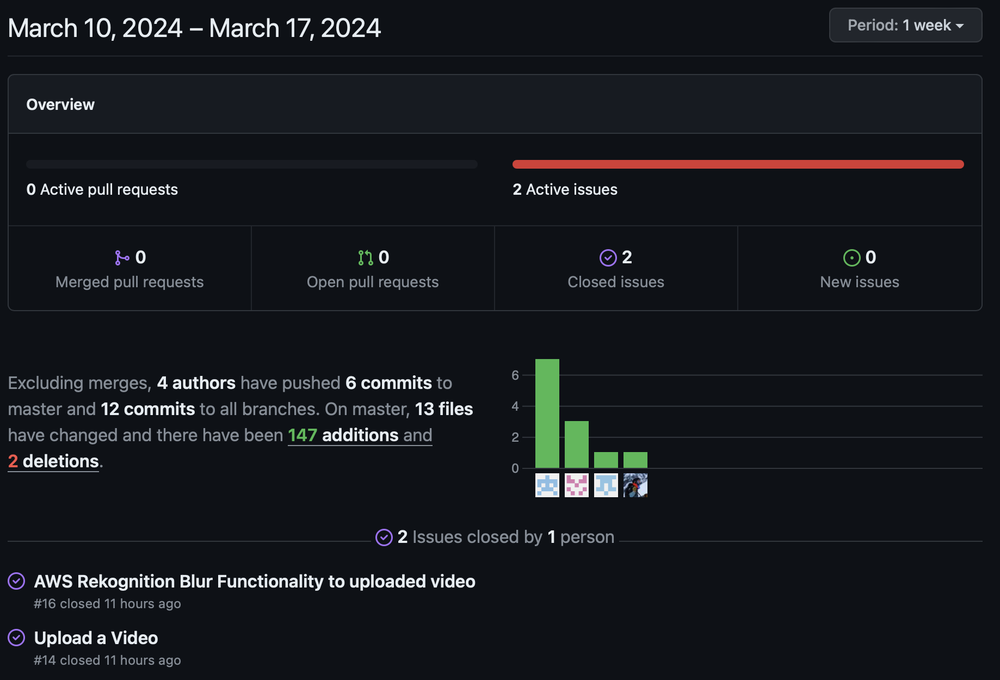

# Team 15

Team Members: 
- Will, SN: 63271324 (Willg0115)
- Mac, SN: 11939873, (mvibert88)
- Kyle, SN: 46335485, (kyle-keim) 
- Saksham, SN 36931343 (sakshamrana7)

## Mar 11th - 17th 2024

## Milestone Goals: 
- fix video blurring integration
- add notification in header for friend requests

## Pulse from the last week:

#### This week, we finally fixed the video processing implementation! Now we're working on adding a notification feature to alert users that they have a pending friend request. Now that all of our major features are impleneted we'll be spending our time fixing small bugs and making sure everything works smoothly and all the styling is up to standard.

### Manual Tests 

## Weekly Context
Mac and Will spent a lot of time trying to fix video blurring lambdas on aws so not that many commits on the github from them. Saksham began working on the notification feature and some ui stuff stuff to display more info to users this week as well. 