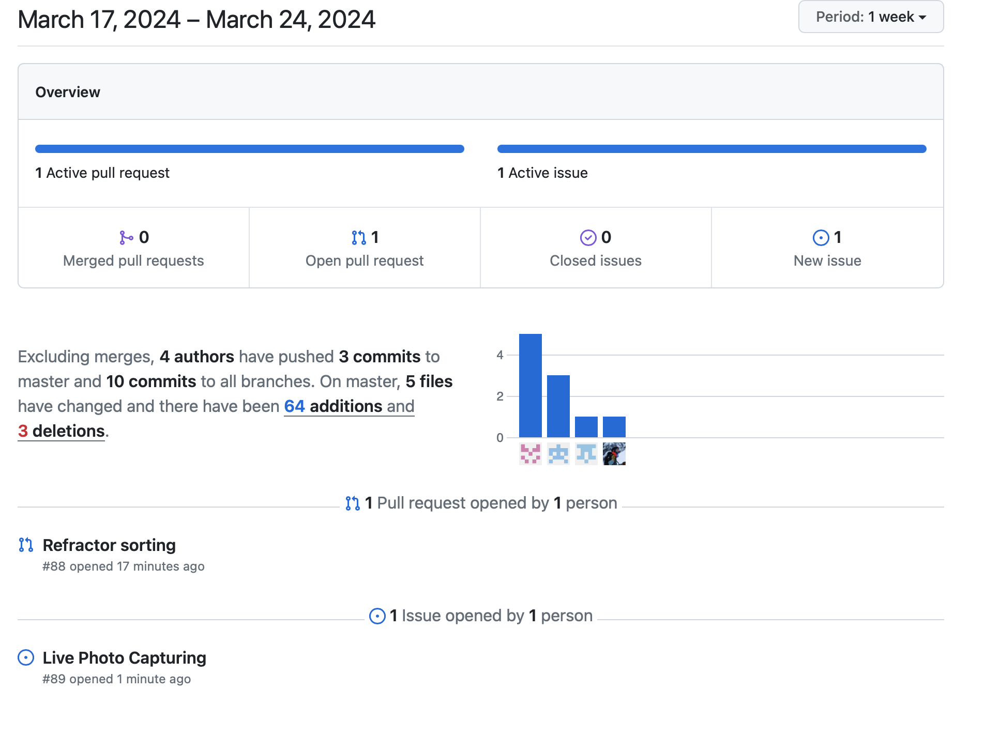
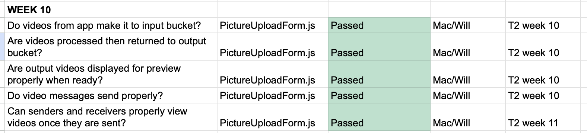

# Team 15

Team Members: 
- Will, SN: 63271324 (Willg0115)
- Mac, SN: 11939873, (mvibert88)
- Kyle, SN: 46335485, (kyle-keim) 
- Saksham, SN 36931343 (sakshamrana7)

## Mar 17th - 24th 2024

## Milestone Goals: 
- fix video blurring integration
- add notification in header for friend requests
- added profile picture in header 

## Pulse from the last week:

#### This week interactive UI features and features such as the proifle picture in the header were added. The only major extra feature we are working on implementing is capturing live picture which user can click from their device and share in chat. Now that all of our major features are impleneted we'll be spending our time fixing small bugs and making sure everything works smoothly and all the styling is up to standard.

### Manual Tests 

## Weekly Context
Mac worked on fixing the S3 buckets security risks as they were public and the client emailed us regarding the same.
Will worked on fixing bugs, cache issues specifically.
Saksham has added profile picture in the header and other UI features in order to have an interactive UI
We also did a meeting to review our code and resolve conflicts in order to have our dev branch ready as we are close to project delivery.