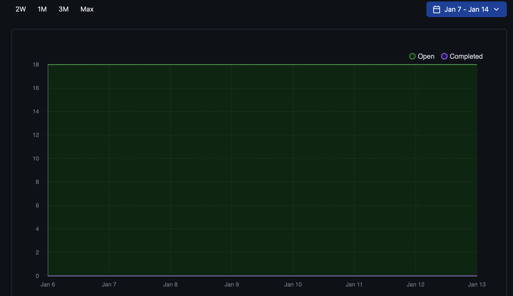
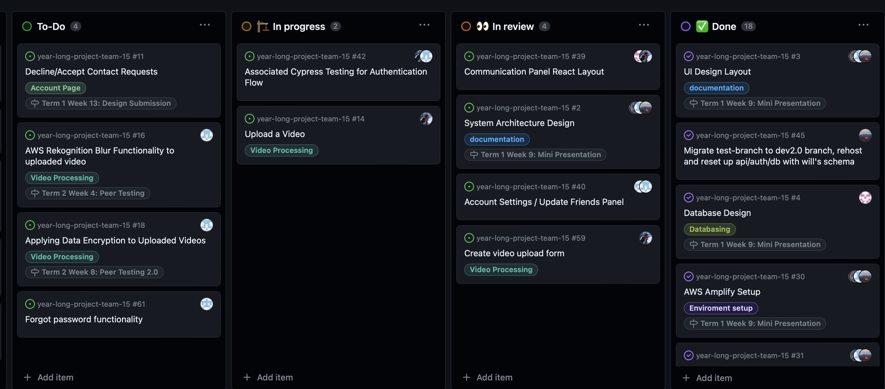

# Team 15

Team Members: 
- Will, SN: 63271324 (Willg0115)
- Mac, SN: 11939873, (mvibert88)
- Kyle, SN: 46335485, (kyle-keim) 
- Saksham, SN 36931343 (sakshamrana7)

## Jan 8th - Jan 14th 2024

## Milestone Goals: 
- Continue to work on features from last term
- implement video blurring functionality with AWS rekognition 
- Automated tests for all features

## Burnup Chart from the last two weeks:

#### This week, we met and decided to continue working independently on our individual features. Had some issues with cypress which will hopefully be resolved next week. Manual testing for now.

Completed tasks these weeks:
- file upload popup 
- manual testing reports

## Completed / In Progress Task Board

## Weekly Context
First week back at school, getting back in the flow and getting our local devlopment environments back up and running. Continuing to pick away at coding our features and testing. 

Next week, we're gonna keep doing the same thing. Everyone will contribute to their portions and get their features working and tested. 
