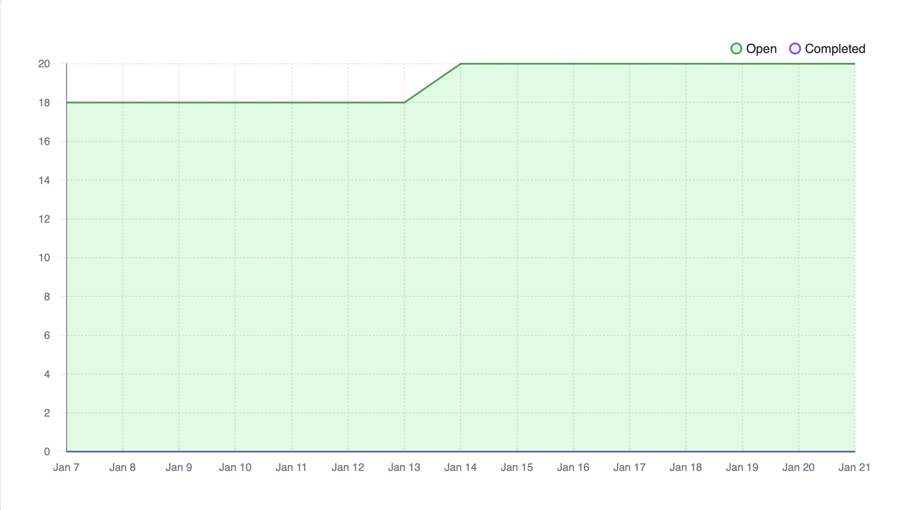
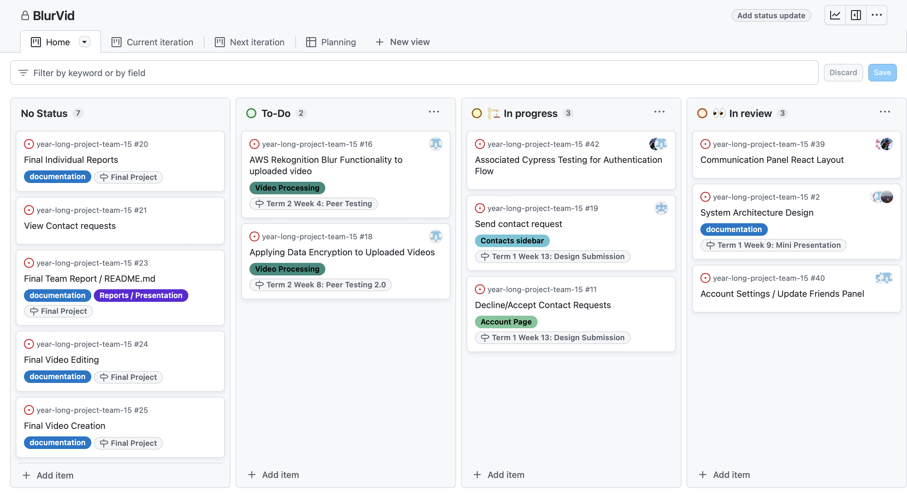

# Team 15

Team Members: 
- Will, SN: 63271324 (Willg0115)
- Mac, SN: 11939873, (mvibert88)
- Kyle, SN: 46335485, (kyle-keim) 
- Saksham, SN: 36931343 (sakshamrana7)

## Jan 14th - Jan 21st 2024

## Milestone Goals: 
- Continue to work on features from last term
- Implement video/photo blurring functionality with AWS rekognition 
- Automated tests for all features
- Implement video data encryption

## Burnup Chart from the last two weeks:

#### This week, we met and decided to continue working independently on our individual features. Had some issues with cypress which will hopefully be resolved next week. Manual testing for now.

Completed tasks these weeks:
- Forgot Password
- Files uploading to AWS S2 Bucket

## Completed / In Progress Task Board

## Weekly Context
Everyone worked on their assigned features. Our next features to implement are AWS recognition blur functionality and applying data encryption
Saksham has got issues with configuration but we will work on it during team meeting on tuesday and then he can test and get account functionality fully working.

