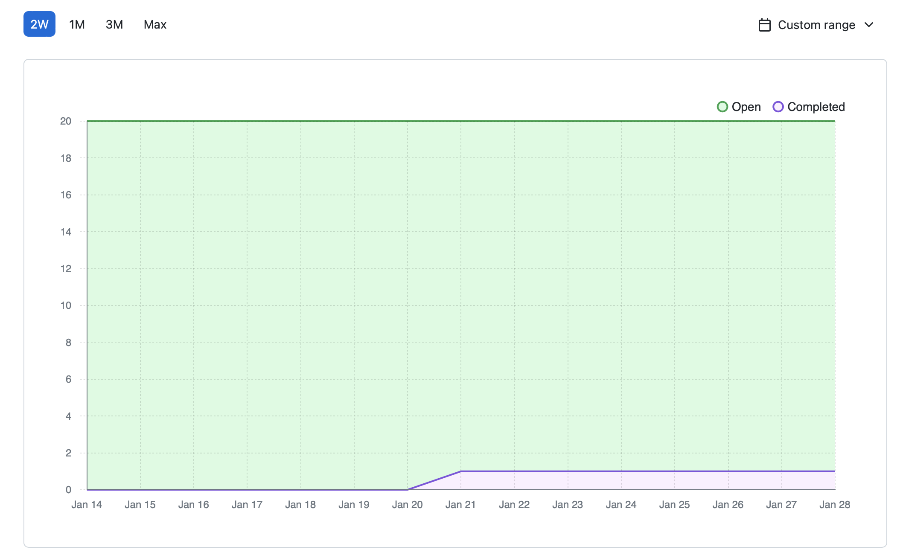

# Team 15

Team Members: 
- Will, SN: 63271324 (Willg0115)
- Mac, SN: 11939873, (mvibert88)
- Kyle, SN: 46335485, (kyle-keim) 
- Saksham, SN: 36931343 (sakshamrana7)

## Jan 21st - Jan 28th 2024

## Milestone Goals: 
- Research for Instant message feature and change the backend accordingly as we are facing a roadblock with this feature
- Implement video/photo blurring functionality with AWS rekognition 
- Automated tests for all features
- Implement video data encryption

## Burnup Chart from the last two weeks:

Completed tasks these weeks:
- Add Friend Pop-up
- Merging branches to main 
- Prepare Questionaires for peer testing

## Completed / In Progress Task Board

## Weekly Context
Everyone worked on their assigned features. Our next features to implement are AWS recognition blur functionality and applying data encryption.
New UI for adding friend was added.