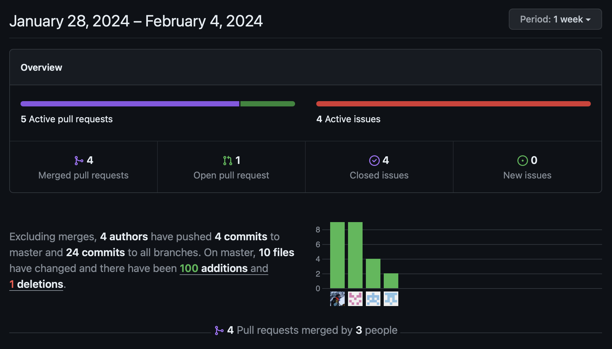
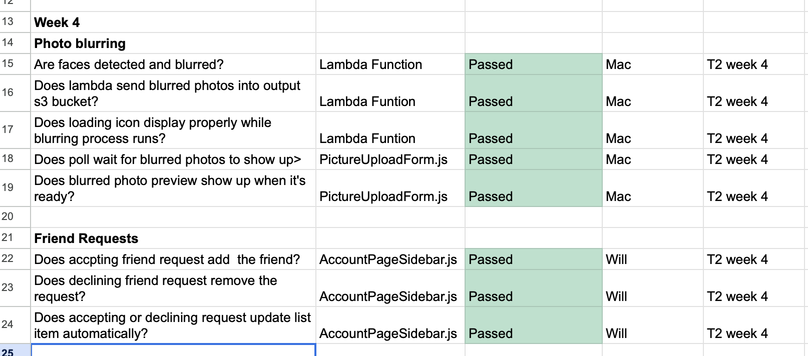

# Team 15

Team Members: 
- Will, SN: 63271324 (Willg0115)
- Mac, SN: 11939873, (mvibert88)
- Kyle, SN: 46335485, (kyle-keim) 
- Saksham, SN 36931343 (sakshamrana7)

## Jan 28th - Feb 4th 2024

## Milestone Goals: 
- Setup photo blurring pipeline
- Fix sending and accepting friend requests  
- Refactor cluttered files
- Fix UI elements (accept/decline button, reorganize header)

## Pulse from the last week:

#### This week, Mac setup the photo blurring pipeline and will fixed the contact adding functionalities. We all worked together to try to fix bugs for a couple hours on tuesday and prepared our heuristics for the peer-evals. 

Completed tasks these weeks:
- Setup photo blurring pipeline
- Fix sending and accepting friend requests  
- Refactor cluttered files
- Fix UI elements (accept/decline button, reorganize header)

### Manual Tests

## Weekly Context
Super productive week. Got bugs fixed and accomplished all of our goals. Photo blurring piepline is up and finctional, video blurring will work the same way so frontend logic is ready for that implmentation. Adding contacts working aswell. Will also fixed the header and moved the logout button and account button into a dropdown from the profile page. Saksham also started to implement profile pictures. Looking forward to getting shared files working and setting up video blurring on AWS. All tests done manually this week. 
