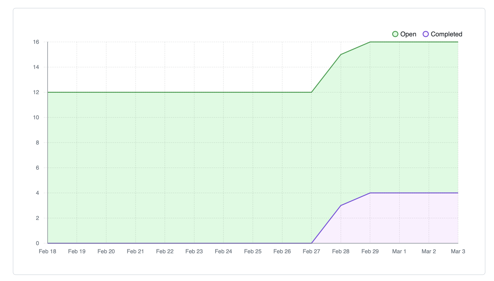

# Team 15

Team Members: 
- Will, SN: 63271324 (Willg0115)
- Mac, SN: 11939873, (mvibert88)
- Kyle, SN: 46335485, (kyle-keim) 
- Saksham, SN 36931343 (sakshamrana7)

## Feb 25th - March 3rd 2024

## Milestone Goals: 
- get shared files working
- display shared videos within chatview 
- fix profile picture issue 
- Implement chat conversation feature
- Implement forgot password feature

## Burnup from the last week:

Completed tasks these weeks:
- forgot password feature
- sharing videos between users 
- shared videos display within chat view 
- sharing text messages
- real time updation
- fixed profile pics, user profile page

## Weekly Context
This week, we successfully implemented the chat conversation feature and integrated it with the existing video uploading functionality within the chat window. Additionally, we have implemented the ability to delete friends and enhanced the MUI design to make the app more user-friendly. The progress of the app is going as per the plan and we are looking forward to peer-testing 2. 
