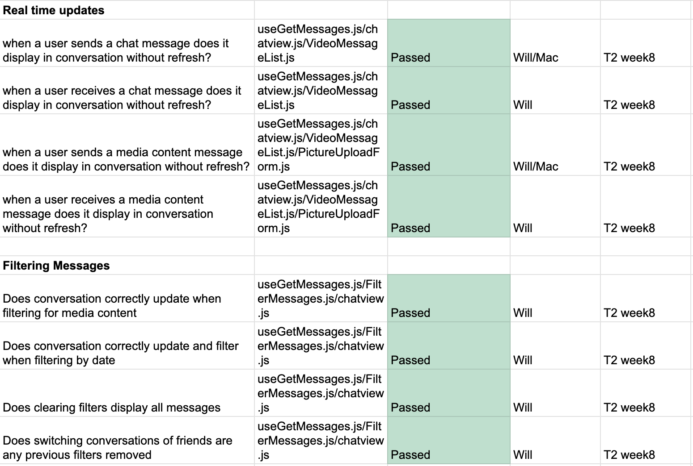

# Team 15

Team Members: 
- Will, SN: 63271324 (Willg0115)
- Mac, SN: 11939873, (mvibert88)
- Kyle, SN: 46335485, (kyle-keim) 
- Saksham, SN 36931343 (sakshamrana7)

## Mar 4th - 10th 2024

## Milestone Goals: 
- Complete Peer testing 2.0
- fix integration issues with our app and video-processing pipeline
- implement feedback from peers

## Pulse from the last week:

#### This week, our team participated in peer testing 2.0 and we continued to try and debug integrations issues between the app and video-processing pipline. We also implemented some peer feedback on the apps account page.

### Updating Manual Tests 

## Weekly Context
A little slow on progress at the moment but we will get our bug fixed and make some final adjustments so we can move onto our final reports and demos.
