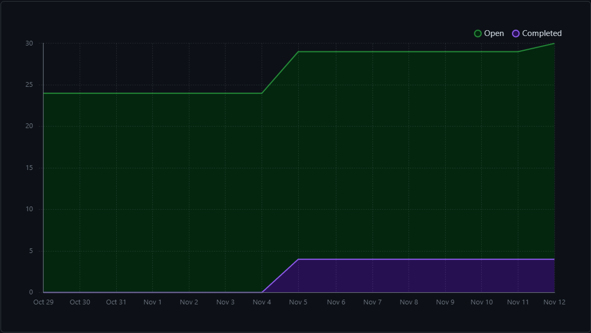
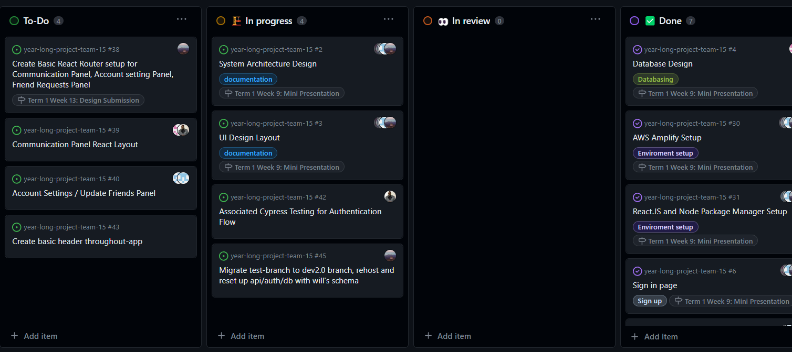

# Team 15

Team Members: 
- Will, SN: 63271324 (Willg0115)
- Mac, SN: 11939873, (mvibert88)
- Kyle, SN: 46335485, (kyle-keim) 
- Josh, SN 13622584 (JoshFarwig)
- Saksham, SN 36931343 (sakshamrana7)

## Week 10 (Nov 5th - Nov 12th) 

This week, we did not complete much in terms of the project. We did a little bit of project planning and generally talked about who would like to 
work on either the Account Settings or the Communication Panel. We discussed testing for our Authentication flow as well.

Next week, we will get another dev env setup through Amplify for the authentication and then create some of the component, and some routing for the two main pages. 

## MileStone Goals: Design Milestone
- Completing DB Structure 
- Account Page UI / Some functionailites
- Communication Panel UI / Some functionalites
- Associated testing 

## Burnup Chart 

## This Week's Goals 
- Migrate test-branch and rehost app on amplifiy so we can start creating components
- Do cypress testing for Authenitcation

## In Progress / Completed Task Board

## Next Week's Goals 
- Migrate test-branch and rehost app on amplifiy so we can start creating components
- Create basic routing
- Do cypress testing for Authenitcation

