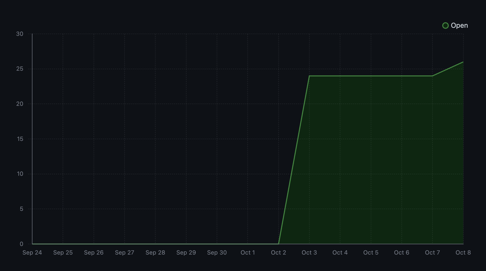
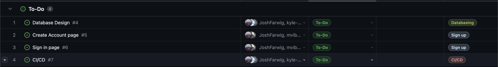
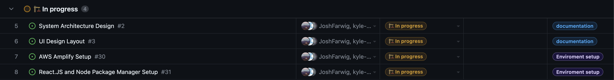

# Team 15

Team Members: 
- Will, SN: 63271324 (Willg0115)
- Mac, SN: 11939873, (mvibert88)
- Kyle, SN: 46335485, (kyle-keim) 
- Josh, SN 13622584 (JoshFarwig)
- Saksham, SN 36931343 (sakshamrana7)

## Week 4 (Sep 24th - Oct 1st) 

### For this week, we voided the burnup chart / task board due to the project planning, no github work was done

This week, we focused most of our attention to the project proposal and project plan. 
During class on thursday, we dicussed how the UI of the software could look like and tried 
visualization our user scenarios. This helped in our process of breaking down some of the features 
however some of our milestone features are still generalized.  

Next week, we will begin setting up our repo so that we can translate our proposal onto our project board, as well 
as beginning to learn the AWS and other JS softwares we will need to use for our project. 

## Week 5 (October 2nd - 8th)
**Milestone Goals** 
- User Database Structure / DB setup 
- Create Account / Sign Up Page  
- Basic account page to show sign in functionality
- Associated testing?

**This Week's Goals:**

- Creat github project board for tasks to be completed for the entire project
- assign tasks to miles stones
- assign this milestones tasks to group members
- set up AWS accounts
- Set up *AWS Amplify*

**BurnUp Chart** 

**Project Board**

To-Do:

In Progress:

Done:

This week we completed creating our initial project board and assigning tasks to milestones and some tasks to team members. We were also able to Login into our AWS accounts. *AWS Amplify* Setup was delayed after running into permission issues with AWS services, which are now fixed and will be completed in the next week.

