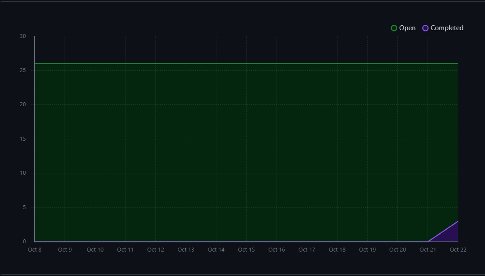
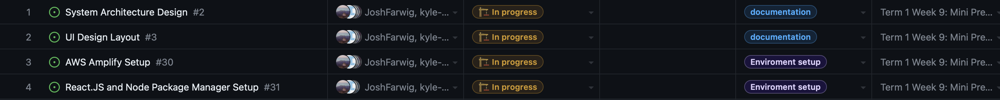
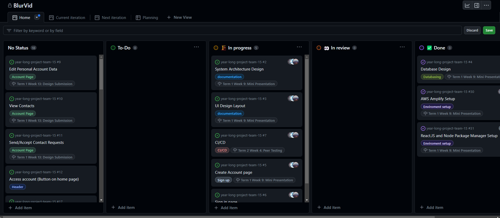

# Team 15

Team Members: 
- Will, SN: 63271324 (Willg0115)
- Mac, SN: 11939873, (mvibert88)
- Kyle, SN: 46335485, (kyle-keim) 
- Josh, SN 13622584 (JoshFarwig)
- Saksham, SN 36931343 (sakshamrana7)

## Week 6-7 (Oct 8th - Oct 22th) 

## Milestone Goals: 
- User Database Structure / DB setup 
- Create Account / Sign Up Page  
- Basic account page to show sign in functionality
- Associated testing

## Burnup Chart from the last two weeks:

### In week 6, we started designing our ui with figma, set up our repo access with aws and started to learn React 

Goals for Week 6: 
- UI design for sidebar and homepage 
- Setup AWS with github repo
- Learn react 
- Setup react app

This week, we started designing our UI with figna. We created a mock UI for our sidebar, and main document exchange page. We also resolved an issue regarding giving AWS the proper access to our GitHub repository. Also, since we chose React as our frontend library and we are not very familiar with it, we are taking some time for ourselves this week to start our learning process and learn as much as we can before we start coding. We completed all of goals for the week. 

In progress tasks this week: 
 

Next week, we will continue with our UI design mockups for all the remaining pages and components. We will also start coding and get our react app and routing setup. Then if we have learnt enough and have finalized our UI designs, we will start building some react components!

### In week 7, we continued our React.JS learning process, set up Amplifly Studio, discussed DB Design 

Goals for Week 7: 
- Finalize rest of UI 
- Integrate Amplify Studio, begin working on Auth / DB Design  

This week, we worked on getting familar with the Amplify Studio Interface. It took some time to integrate the Amplify in CLI with our user accounts as we were having issues with using CLI commands and accessKeys, so we ended up using the UI interface instead (Studio) to set up our repo. After doing this, we were able to use amplify CLI setup commands to configure database options. Will worked on a DB Design for our project. Josh is refactoring the UI to an Amplify Specifc Kit in Figma that will allow to use to generate React Components

There are a few more React Concepts we need to learn, I.E. routing, more fine-tune state management, and others, however we will begin creating the general app skeleton, then work towards these features in the future.

Completed tasks this week:
- DB Design
- Amplifiy Studio / Full Repo Integration 

Completed / In Progress Task Board

Next week, We will continue looking into React concepts, and begin working on User Auth / Sign in and Sign up pages. 