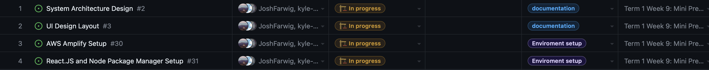

# Team 15

Team Members: 
- Will, SN: 63271324 (Willg0115)
- Mac, SN: 11939873, (mvibert88)
- Kyle, SN: 46335485, (kyle-keim) 
- Josh, SN 13622584 (JoshFarwig)
- Saksham, SN 36931343 (sakshamrana7)

## Week 6 (Oct 8th - Oct 15th) 

### For this week, we started designing our ui with figma, set up our repo access with aws and started to learn React

Goals: 
- UI design for sidebar and homepage 
- Setup AWS with github repo
- Learn react 
- Setup react app

This week, we started designing our UI with fignma. We created a mock UI for our sidebar, and main document exchange page. We also resolved an issue regarding giving AWS the proper access to our GitHub repository. Also, since we chose React as our frontend library and we are not very familiar with it, we are taking some time for ourselves this week to start our learning process and learn as much as we can before we start coding. We completed all of goals for the week. 

In progress this week: 
 

Next week, we will continue with our UI design mockups for all the remaining pages and components. We will also start coding and get our react app and routing setup. Then if we have learnt enough and have finalized our UI designs, we wills start building some react components!