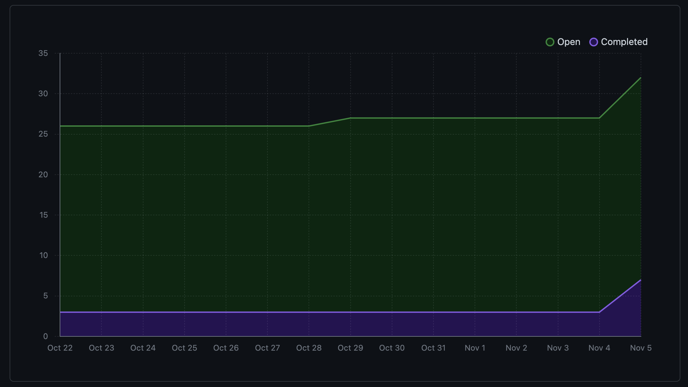
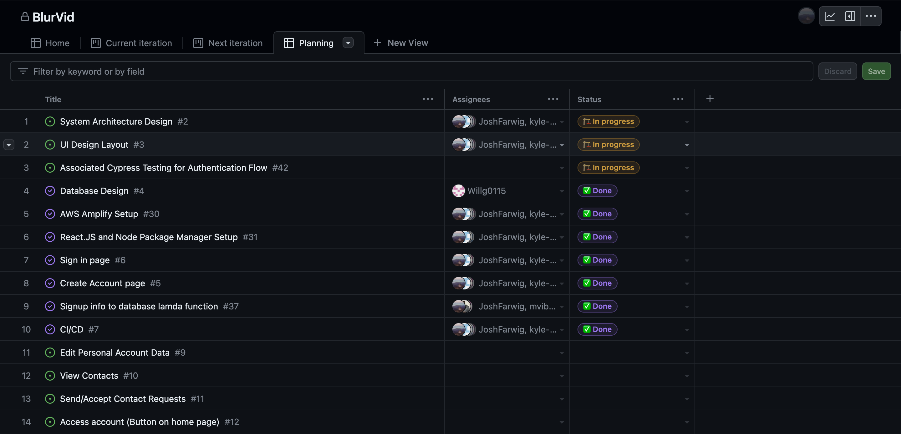

# Team 15

Team Members: 
- Will, SN: 63271324 (Willg0115)
- Mac, SN: 11939873, (mvibert88)
- Kyle, SN: 46335485, (kyle-keim) 
- Josh, SN 13622584 (JoshFarwig)
- Saksham, SN 36931343 (sakshamrana7)

## Week 9 (Oct 29th - Nov 5th) 

## Milestone Goals: 
- Mini Presentation
- Discuss and divide UI layout components implementation
- Task division for future milestone such as edit profile feature, chat feature

## Burnup Chart from the last two weeks:

 

## In week 10, We will work on our UI layout and implement next features of our project

Goals for Week 10: 
- UI layout components implementation
- Cypress Testing

Completed tasks this week:
- Mini Presentation
- Task Division 

## Completed / In Progress Task Board
 

## Weekly Context
This week we are mostly concerned with preparing presentation flow and then and the UI design.
